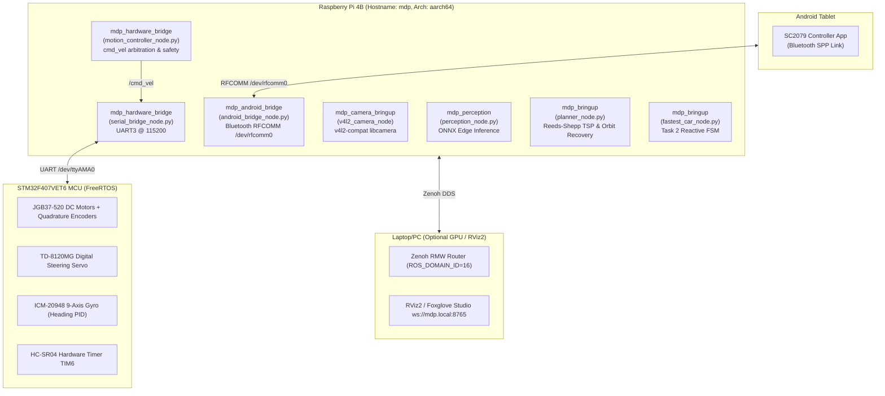

# 🤖 AGENTS.md — Agent Developer Guide & System Handbook
**SC2079 Multidisciplinary Design Project (MDP) — Group 16**
**Robot Platform:** Raspberry Pi 4B (Debian trixie, aarch64) + STM32F407VET6 MCU + Android Tablet

Welcome, AI Agent! This document is your comprehensive operational guide, architectural reference, and coding standard manual for the Group 16 MDP robot system. Read this before inspecting code or proposing modifications.

---

## 1. System Overview & Physical Architecture

The robot is a custom Ackermann-steering autonomous vehicle designed for the NTU SC2079 MDP competition. It operates across two primary competitive events and one grading checklist:
1. **Checklist Mode:** Lab checkoffs C.1–C.10 (teleoperation, sensor streaming, C.10 pose reporting, E-STOP).
2. **Task 1 (Autonomous Exploration):** Fully autonomous navigation to 4–8 obstacles in a 200×200 cm arena, image target recognition via camera/YOLO, and Bull's Eye Orbit Recovery (§2.3).
3. **Task 2 (Fastest Car Sprint):** Autonomous high-speed sprint across an unmapped 2-obstacle slalom track, reading arrow cues, looping 180°, and returning to park inside the carpark.



---

## 2. Directory Layout & Subsystem Architecture

### 2.1 Repository Structure
```text
/home/mdp/dev/SC2079-Group-16/
├── ros2_ws/                     # Active ROS 2 Jazzy workspace & Pixi environment
│   ├── src/
│   │   ├── mdp_bringup/         # High-level mission FSMs & orchestration launch files
│   │   ├── mdp_hardware_bridge/ # STM32 UART bridge & ultrasonic/IR sensor nodes
│   │   ├── mdp_android_bridge/  # Android RFCOMM Bluetooth bridge & telemetry dispatcher
│   │   ├── mdp_camera_bringup/  # Raspberry Pi libcamera v4l2 capture launch
│   │   ├── mdp_perception/      # On-device ONNX YOLO inference & symbol consensus
│   │   └── mdp_interfaces/      # Custom ROS 2 IDL definitions (services & messages)
│   ├── pixi.toml                # Pixi environment manifest (pi and pc targets)
│   └── ARCHITECTURE.md          # In-depth architectural design decisions
├── algorithm/                   # Pure-Python pathfinding, Reeds-Shepp & simulator
│   ├── reed_shepp.py            # Analytical 48-curve Reeds-Shepp shortest path engine
│   ├── planning.py              # Configuration space collision checker & A* fallback
│   ├── planner.py               # Complete TSP tour generator & command discretizer
│   ├── arena.py                 # Source of truth: arena geometry, obstacles, and coordinates
│   ├── simulator.py             # Pygame 2D interactive graphical simulator
│   └── test/                    # Unit tests for algorithm package
├── stm32/                       # STM32F407 PlatformIO FreeRTOS firmware
│   ├── src/main.c               # FreeRTOS tasks (comm_task, MotorTask, PID loops)
│   ├── include/                 # Driver headers (ICM20948, OLED, PID)
│   ├── platformio.ini           # Build flags, upload flags, baud rates
│   └── FLASHING.md              # Hardware flashing & bootloader instructions
├── android/                     # Native Android Tablet Controller (Java / Gradle)
│   └── app/src/main/java/com/sc2079/group16/controller/
│       ├── MainActivity.java        # Tab navigation, buttons, telemetry observer
│       ├── BluetoothLinkService.java# RFCOMM background thread & wire serializer
│       ├── ArenaView.java           # Custom Canvas 2D arena & robot renderer
│       └── JoystickView.java        # Dual-axis low-latency manual driving widget
├── models/                      # Neural network weights & class metadata
│   ├── best.onnx                # Edge-optimized target classification model
│   ├── best.pt / bestTask2.pt   # PyTorch YOLO weights
│   └── mapping.json             # Symbol ID label mappings (11..40)
├── docs/                        # Specifications, audit reports, and protocol manuals
└── MEMORY.md                    # Persistent Engineering Log: critical bugfixes & calibration
```

### 2.2 Subsystem Responsibilities & Interaction Contracts
1. **`mdp_interfaces`**: Zero-logic schema package. Defines `ExecuteMoves.srv`, `MoveCommand.msg`, and `SampleTarget.srv`. All nodes depend on this; it never depends on other nodes.
2. **`mdp_hardware_bridge`**: `serial_bridge_node` exclusively owns `/dev/ttyAMA0`, converts `/cmd_vel` into five-byte binary `V` packets, parses continuous `TLM` feedback, and manages E-STOP/reset. `motion_controller_node` exclusively owns `/execute_moves`, measures primitive completion from raw pose/range feedback, arbitrates teleop and autonomous motion, and publishes the base `/cmd_vel`. Kalman filters smooth only the display/navigation streams; safety uses raw feedback.
3. **`mdp_android_bridge`**: The **exclusive owner** of `/dev/rfcomm0`. Dispatches tablet commands to ROS 2 topics/services and streams throttled telemetry (`ROBOT`, `POSE`, `T1_STATE`, `T2_STATE`, `SENSORS`) back to the tablet.
4. **`mdp_bringup`**: The high-level mission brain:
   - `planner_node.py`: Task 1 TSP planner, Bull's Eye Orbit Recovery, and latched proximity stops.
   - `fastest_car_node.py`: Task 2 reactive sprint FSM, arrow classification parser, carpark return.
5. **`mdp_perception`**: Edge ONNX inference service. Captures frames from `/camera/image_raw` or Pi camera, applies letterboxing and NMS, validates confidence, and returns confirmed symbol consensus.
6. **`algorithm`**: Standalone math engine. Zero ROS dependencies. Can be imported directly by ROS 2 nodes or executed standalone on any PC/Mac.

---

## 3. Code Standards & Engineering Conventions

All agents writing or refactoring code in this repository MUST adhere to the following standards:

### 3.1 Python & ROS 2 Coding Standards
* **Python Version:** Python 3.12 (managed via Pixi environment).
* **Style Guide:** Conform strictly to **PEP 8**. Use 4 spaces per indent level (never tabs). Maximum line length is 100 characters.
* **Type Annotations:** All public functions, methods, and dataclass fields MUST include type hints (`from typing import Optional, List, Tuple, Dict`).
* **Node Lifecycle & Class Structure:**
  - All ROS nodes must inherit from `rclpy.node.Node`.
  - Use `ReentrantCallbackGroup` and `MultiThreadedExecutor` whenever a node provides a service and calls other services or subscriptions concurrently.
  - Wrap entrypoint execution with `try ... except (KeyboardInterrupt, ExternalShutdownException): pass`.
* **Logging Discipline:**
  - **NEVER use bare `print()` statements** in ROS 2 nodes.
  - Always use `self.get_logger().info(...)`, `self.get_logger().warn(...)`, or `self.get_logger().error(...)`.
  - Throttled logging (`throttle_duration_sec=...`) must be used for periodic telemetry loops to prevent saturating stdout or Zenoh middleware.
* **Hardware & Serial Exception Handling:**
  - Never allow raw hardware errors to crash the node. Catch `termios.error`, `serial.SerialException`, and `serial.SerialTimeoutException` explicitly.
  - Clean up socket and serial file descriptors in `destroy_node()`.

### 3.2 Pure-Python Algorithm Standards (`algorithm/`)
* **Zero External Middleware Dependencies:** Code inside `algorithm/` MUST NEVER import `rclpy`, `serial`, ROS 2 messages, or external UI toolkits (except Pygame in `simulator.py`).
* **Coordinate & Unit Purity:**
  - Coordinates are **centimetres** (`float`).
  - Headings are **radians** (`float`) wrapped to $(-\pi, \pi]$, with $\text{East} = 0$, CCW positive.
  - Poses must be passed as `Config(x, y, theta)` or `(x, y, theta)` tuples.
* **Mathematical Invariants & Self-Verification:**
  - Fast self-checks (e.g. `_verify()` in `reed_shepp.py`) run at import time to immediately catch any regression or sign inversion.
  - All geometric collision functions must remain vectorised via NumPy where practical.

### 3.3 STM32 Embedded C & FreeRTOS Standards (`stm32/`)
* **C Standard:** C99 with STM32Cube HAL.
* **Task Stack Headroom (MANDATORY):**
  - `defaultTask`: Minimum **2048 bytes** (`512 * 4`).
  - `MotorTask`: Minimum **1024 bytes** (`256 * 4`).
  - *Rationale:* Floating-point operations, `snprintf`, and FPU context saving on Cortex-M4 overflow smaller stacks, triggering unrecoverable HardFaults.
* **Concurrency & Synchronization:**
  - Variables modified across tasks or ISRs (e.g., `runRequested`, `estopFlag`, `rxIndex`) MUST be qualified with `volatile`.
  - Use FreeRTOS critical sections (`taskENTER_CRITICAL()` / `taskEXIT_CRITICAL()`) or `vTaskSuspendAll()` when timing-sensitive hardware operations occur (e.g., HC-SR04 microsecond echo timing on `TIM6`).
* **Hardware Loop Safety (No Unbounded Loops):**
  - **NEVER** write unbounded loops waiting for hardware pins or flags:
    ```c
    // FORBIDDEN:
    while (__HAL_TIM_GET_FLAG(&htim6, TIM_FLAG_UPDATE) == RESET);

    // REQUIRED:
    uint32_t start_tick = HAL_GetTick();
    while (__HAL_TIM_GET_FLAG(&htim6, TIM_FLAG_UPDATE) == RESET) {
        if (HAL_GetTick() - start_tick > TIMEOUT_MS) { handle_error(); break; }
    }
    ```
* **Protocol Strictness:** All incoming UART commands must match the fixed 5-byte specification. Verify input bounds with `atoi()` before executing motor actuation.

### 3.4 Android Java Standards (`android/`)
* **Framework:** Android SDK API 34, Java 17.
* **Threading Rules:**
  - All Bluetooth socket reads/writes MUST execute on a dedicated background worker thread (`ConnectedThread`).
  - UI updates MUST be posted back to the main thread via `Handler(Looper.getMainLooper()).post(...)`.
* **Resource Lifecycle & Memory Safety:**
  - In `MainActivity.java`, remove all pending Handler callbacks and unbind services inside `onDestroy()`.
  - Avoid creating garbage collector churn in `onDraw()` of `ArenaView.java` (pre-allocate `Paint`, `Path`, and `RectF` objects in constructors).
* **Protocol Parsing:**
  - Bluetooth message parsers must use strict delimiter matching (`split(",")`) and wrap payload conversions in `try ... catch (NumberFormatException e)`.

### 3.5 Testing & Verification Standards
* **100% Pass Rate Policy:** The full automated test suite (`pixi run -e pi test-all`) must pass with **0 errors and 0 failures** before and after every modification.
* **Hardware Decoupling:** Unit tests must run completely decoupled from physical hardware:
  - Mock serial UART ports using `unittest.mock.MagicMock`.
  - Mock Bluetooth sockets and ROS services.
* **Regression Protection:** Every new bug fix or feature must include a corresponding unit test in the appropriate test suite:
  - Algorithm tests -> `algorithm/test/test_*.py`
  - Bridge tests -> `src/mdp_hardware_bridge/test/` and `src/mdp_android_bridge/test/`
  - Planner FSM tests -> `src/mdp_bringup/test/`

### 3.6 Documentation & Knowledge Synchronization Standards
* **Mandatory Documentation Updates:** Whenever implementing any code change, bugfix, architectural adjustment, interface modification, protocol update, or configuration change, agents MUST immediately identify and update all related documentation.
* **Zero Documentation Drift:** Documentation must remain an accurate source of truth reflecting the actual codebase state:
  - If wire formats, packets, or commands change, update Section 6 in [`AGENTS.md`](file:///home/mdp/dev/SC2079-Group-16/AGENTS.md) and [`ARCHITECTURE.md`](file:///home/mdp/dev/SC2079-Group-16/ros2_ws/ARCHITECTURE.md).
  - If hardware behavior, calibration offsets, or runtime anomalies are resolved, update [`MEMORY.md`](file:///home/mdp/dev/SC2079-Group-16/MEMORY.md).
  - If ROS interfaces, parameters, or launch structures change, update package READMEs and `docs/`.
* **Verification of Documentation:** Always ensure documentation is checked for accuracy and consistency before completing a task. Never leave documentation stale, conflicting, or out of date.

---

## 4. Environment & Tooling Rules (Strictly Enforced)

### 4.1 Always Use Pixi for Python & ROS 2
The robot runs Debian 13 (aarch64). All ROS 2 Jazzy dependencies, compilers, and Python packages are managed through **Pixi**.
* **Working Directory:** `/home/mdp/dev/SC2079-Group-16/ros2_ws` (auto-navigated on interactive login via `~/.profile` and `~/.bashrc`).
* **Target Environment:** Always specify `-e pi` on the Raspberry Pi.
* **NEVER** run bare `pip install` or modify system Python packages.
* **NEVER** run bare `colcon build` or `ros2` without Pixi activation or using the aliases.

### 4.2 Shell Aliases & Environment Wrappers
The system configuration in `/home/mdp/.bash_aliases` provides pre-configured wrappers so operations can be invoked from any directory:
```bash
# Sourcing / Environment Wrappers (run from any directory)
alias ros2="pixi run --manifest-path /home/mdp/dev/SC2079-Group-16/ros2_ws/pixi.toml -e pi ros2"
alias colcon="pixi run --manifest-path /home/mdp/dev/SC2079-Group-16/ros2_ws/pixi.toml -e pi colcon"
alias pixi-pi="pixi run --manifest-path /home/mdp/dev/SC2079-Group-16/ros2_ws/pixi.toml -e pi"

# Navigation & Cleanup
alias mdp-cd="cd /home/mdp/dev/SC2079-Group-16/ros2_ws"
alias mdp-kill="pkill -9 -f 'serial_bridge_node|android_bridge_node|planner_node|perception_node|foxglove_bridge|pi_camera_node|system_camera_streamer|rmw_zenohd|static_transform_publisher' 2>/dev/null || true"

# Master Operations (auto-cleans stale processes and switches to workspace)
alias mdp-robot="mdp-kill && cd /home/mdp/dev/SC2079-Group-16/ros2_ws && pixi run -e pi robot"
alias mdp-task2="mdp-kill && cd /home/mdp/dev/SC2079-Group-16/ros2_ws && pixi run -e pi task2"
alias mdp-teleop="mdp-kill && cd /home/mdp/dev/SC2079-Group-16/ros2_ws && pixi run -e pi teleop"
alias mdp-hardware="mdp-kill && cd /home/mdp/dev/SC2079-Group-16/ros2_ws && pixi run -e pi hardware"

# Testing & Diagnostics
alias mdp-test-all="cd /home/mdp/dev/SC2079-Group-16/ros2_ws && pixi run -e pi test-all"
alias mdp-estop="ros2 topic pub -1 /estop std_msgs/msg/Empty {}"
```

### 4.3 Networking & Middleware
* **ROS Domain ID:** `ROS_DOMAIN_ID=16` (shared across all nodes and optional PC visualizers).
* **RMW Middleware:** `rmw_zenoh_cpp` with Zenoh router daemon (`rmw_zenohd`). This bypasses university Wi-Fi UDP multicast restrictions and bridges seamlessly over Tailscale or direct LAN.

---

## 5. Essential Agent Command Cheat Sheet

All commands below are executed from `/home/mdp/dev/SC2079-Group-16/ros2_ws` unless specified otherwise.

### 5.1 Running the Automated Test Suites
Group 16 maintains a **100% pass rate (91/91 tests)**. Run all unit tests before and after any code modification:
```bash
# Run ALL test suites across algorithm, bridges, and planner:
pixi run -e pi test-all

# Or run individual test suites:
pixi run -e pi test-algo     # 13 tests: Reeds-Shepp, geometry, TSP, config space
pixi run -e pi test-bridge   # 59 tests: hardware/motion (43) and Android bridge (16)
pixi run -e pi test-planner  # 19 tests: Task 1 FSM, Task 2 sprint, Bull's Eye orbit recovery
```

### 5.2 Building ROS 2 Packages
```bash
# Incremental build of robot packages on the Pi:
pixi run -e pi build

# Clean colcon build artifacts:
pixi run -e pi clean
```

### 5.3 Launching Robot Operations (USER MANUAL LAUNCH ONLY)

> [!WARNING]
> **DO NOT AUTO-LAUNCH ROS LAUNCHES / BRINGUP COMMANDS AS AN AI AGENT!**
> Multiple AI agents or background tool tasks running ROS launch files concurrently causes process collisions on `/dev/ttyAMA0`, `/dev/rfcomm0`, and the Pi camera, overwhelming RAM and crashing the system.
> **Rule for Agents:** When a live run or launch is needed, **instruct the user to run the command manually in their terminal** instead of launching it yourself.

Commands for the user to run:
```bash
# 1. Checklist Evaluation Mode (Manual teleop, C.10 pose streaming, sensors):
pixi run -e pi teleop

# 2. Task 1 Autonomous Exploration (TSP tour, image recognition, orbit recovery):
pixi run -e pi robot

# 3. Task 2 Fastest Car Reactive Sprint (ultrasonic approach, arrow detection, slalom):
pixi run -e pi task2

# 4. Low-Level Hardware Base (Zenoh, UART bridge, Bluetooth bridge, Camera):
pixi run -e pi hardware
```

### 5.4 STM32 Firmware Operations (PlatformIO)
Firmware source is located in `/home/mdp/dev/SC2079-Group-16/stm32`:
```bash
# Compile STM32 FreeRTOS firmware:
pio run -d /home/mdp/dev/SC2079-Group-16/stm32

# Flash firmware via UART bootloader (DTR/RTS auto-reset):
pio run -d /home/mdp/dev/SC2079-Group-16/stm32 -t upload
```

### 5.5 Interactive Simulator & Diagnostics
```bash
# Launch interactive 2D arena simulator (Pygame):
pixi run -e pi sim

# Test manual movement from terminal (e.g. Forward 10cm, Left 90deg):
mdp-move FC 10
mdp-move FL 90
```

---

## 6. Communication Protocols & Wire Formats

### 6.1 Android ↔ Raspberry Pi (Bluetooth RFCOMM `/dev/rfcomm0`)
Managed by `android_bridge_node.py` (`ros2_ws/src/mdp_android_bridge/`).

| Command / Message | Direction | Meaning / Description |
| :--- | :---: | :--- |
| `FW:<mm>` / `BW:<mm>` | Android → Pi | Move straight forward/backward in mm (debounced via 1-deep queue) |
| `FC:<cm>` / `BC:<cm>` | Android → Pi | Move straight forward/backward in cm |
| `TL:<deg>` / `TR:<deg>` | Android → Pi | Turn left/right by degrees (maps to Ackermann steer + drive) |
| `VEL:<mps>,<radps>` | Android → Pi | Continuous joystick speed/yaw target; streamed at about 20 Hz, with zero on release. |
| `STP` / `STOP` | Android → Pi | Immediate emergency stop (`/estop`) |
| `RESET` | Android → Pi | Unlatches E-STOP, sends `R` packet to STM32, resets FSMs |
| `START` / `ALG:START` | Android → Pi | Triggers Task 1 autonomous exploration |
| `START_TASK2` / `STM:sp` | Android → Pi | Triggers Task 2 fastest car reactive sprint |
| `ALG|<id>,<x>,<y>,<face>...` | Android → Pi | Arena obstacle layout from tablet GUI |
| `STATUS,<text>` | Pi → Android | Curated human-readable status display (avoids serial spam) |
| `DONE` | Pi → Android | Handshake confirming completed movement command |
| `ROBOT,<x>,<y>,<dir>` | Pi → Android | **Checklist C.10** pose: grid cells `0..19`, dir `N,S,E,W` |
| `POSE,<x_cm>,<y_cm>,<yaw_deg>` | Pi → Android | High-precision continuous pose for smooth tablet rendering |
| `T1_STATE,<state>,<leg>,<tot>,<obs>,<face>,<rem_dist>` | Pi → Android | Task 1 mission FSM progress, stopwatch, remaining leg distance |
| `T1_TARGET,<obs_id>,<sym_id>,<sym_name>,<conf>,<face>` | Pi → Android | Confirmed target classification updating tablet map icon |
| `T2_STATE,<state>,<step_idx>,<desc>,<elapsed_sec>` | Pi → Android | Task 2 sprint stepper and millisecond-accurate timer |
| `T2_ARROW,<obs_num>,<LEFT|RIGHT>,<sym_id>,<conf>` | Pi → Android | Real-time arrow classification card (`⬅ LEFT` / `➡ RIGHT`) |
| `SENSORS,<us_cm>,<ir_left_cm>,<ir_right_cm>` | Pi → Android | Throttled (4 Hz) proximity telemetry |
| `ESTOP_ALERT,<sensor>,<dist_cm>,<thresh_cm>` | Pi → Android | E-STOP proximity alert: offending sensor name and measured cm |

### 6.2 Raspberry Pi ↔ STM32 (UART3 `/dev/ttyAMA0`, 115200 Baud, 8N1)
Managed by `serial_bridge_node.py` (`ros2_ws/src/mdp_hardware_bridge/`). All packets are fixed **5 bytes**:

| Packet Bytes | Direction | Description |
| :--- | :---: | :--- |
| `b"V" + <int16 speed_mmps> + <int16 yaw_mradps>` | Pi → STM32 | Current velocity target in signed little-endian units; replaces the previous target. |
| `b"V\x00\x00\x00\x00"` | Pi → STM32 | Ordinary motor stop; does not clear an E-STOP latch. |
| `b"Q\x00\x00\x00\x00"` | Pi → STM32 | **E-STOP:** Immediate hardware interrupt motor cutoff |
| `b"R\x00\x00\x00\x00"` | Pi → STM32 | Reset: stops motion, clears the E-STOP latch and old targets, then waits for fresh telemetry/commands. |
| `TLM:<x>,<y>,<heading>,<us>,<ir_left>,<ir_right>\r\n` | STM32 → Pi | Continuous pose and range feedback in cm/degrees. |
| `STOP:<reason>\r\n` | STM32 → Pi | Asynchronous `PROXIMITY`, `SENSOR_STALE`, `INVALID_VELOCITY`, or recoverable `WATCHDOG` motor stop. |

Legacy `FC`/`BC`/turn batches are no longer used for normal motion. `GC`, `G0`,
and `TO` remain available through `/hardware/maintenance`.

### 6.3 Key ROS 2 Topics and Services
* `/execute_moves` (`mdp_interfaces/srv/ExecuteMoves`): Primary blocking service to command a batch of `MoveCommand` primitives.
* `/cmd_vel/teleop` (`geometry_msgs/msg/Twist`): Manual velocity input owned by the motion controller.
* `/cmd_vel` (`geometry_msgs/msg/Twist`): Sole base velocity output consumed by the serial bridge.
* `/robot_pose` (`geometry_msgs/msg/PoseStamped`): Kalman-filtered dead-reckoned robot pose in arena metric frame (`PoseKalmanFilter`).
* `/robot_pose/raw` (`geometry_msgs/msg/PoseStamped`): Raw unfiltered dead-reckoned pose directly from STM32 odometry/gyro.
* `/sensors/ultrasonic` (`sensor_msgs/msg/Range`): Kalman-filtered forward distance measurement with outlier gating (`KalmanFilter1D`).
* `/sensors/ultrasonic/raw` (`sensor_msgs/msg/Range`): Raw unfiltered HC-SR04 distance measurement.
* `/sensors/ir_left`, `/sensors/ir_right` (`sensor_msgs/msg/Range`): Kalman-filtered angled proximity measurements.
* `/sensors/ir_left/raw`, `/sensors/ir_right/raw` (`sensor_msgs/msg/Range`): Raw IR safety inputs.
* `/perception/sample_target` (`mdp_interfaces/srv/SampleTarget`): Queries camera + YOLO for target symbol consensus.
* `/estop` (`std_msgs/msg/Empty`): System-wide emergency stop topic.

---

## 7. Coordinate Frames & Kinematic Conventions

1. **Arena Coordinate System:**
   * Dimensions: $200\text{ cm} \times 200\text{ cm}$.
   * Origin $(0,0)$: Bottom-left (South-West) corner of the arena.
   * East (+X): $0\text{ rad}$.
   * North (+Y): $+\frac{\pi}{2}\text{ rad}$ ($90^\circ$).
   * West (-X): $\pm \pi\text{ rad}$ ($180^\circ$).
   * South (-Y): $-\frac{\pi}{2}\text{ rad}$ ($-90^\circ$).
   * Orientation $\theta \in (-\pi, \pi]$, counter-clockwise positive.
2. **Grid Indices:**
   * $20 \times 20$ grid of $10\text{ cm} \times 10\text{ cm}$ cells, indices $x, y \in [0..19]$.
   * Cell $(x_g, y_g)$ corresponds to metric center $(x_g \cdot 10 + 5, y_g \cdot 10 + 5)\text{ cm}$.
3. **Vehicle Geometry & Kinematics:**
   * Chassis footprint: $19\text{ cm} width \times 23\text{ cm}$ length.
   * Inflated planning footprint: $27\text{ cm} \times 31\text{ cm}$ ($4\text{ cm}$ safety padding).
   * Measured full-lock turning radius: $R = 21\text{–}22\text{ cm}$; planning and control use $21.0\text{ cm}$.
4. **Gyro Heading Convention:**
   * The STM32 hardware IMU integrates heading clockwise positive.
   * `serial_bridge_node.py` explicitly negates the raw STM32 heading to maintain ROS standard right-handed CCW coordinates. **Do not invert this sign!**
5. **Telemetry Kalman Filtering (`kalman_filter.py`):**
   * **`PoseKalmanFilter` (3-DoF):** Smooths continuous $(x, y, \theta)$ odometry/gyro telemetry received over UART (`TLM:...`), performs circular innovation wrapping across the $(-\pi, \pi]$ boundary, and applies outlier gating ($0.60\text{ m}$) against transient serial drops while synchronizing to authoritative batch completion (`FIN:`).
   * **`KalmanFilter1D`:** Filters HC-SR04 ultrasonic ($q=10^{-3}, r=10^{-2}, \text{gate}=0.30\text{ m}$) and Sharp analog IR streams ($q=10^{-3}, r=10^{-2}, \text{gate}=0.25\text{ m}$). Single-frame multipath reflection spikes are rejected, preventing false emergency stops.
   * Filtered streams feed `/robot_pose`, `/sensors/*`, and all Android Bluetooth telemetry (`POSE`, `ROBOT`, `SENSORS`).

---

## 8. Operational Modes & Autonomous Behaviors

### 8.1 Task 1: Autonomous Exploration & Bull's Eye Orbit Recovery (§2.3)
1. **Planning:** Receives obstacle list (`ALG|...`), places target vantages $25\text{ cm}$ standoff from obstacle faces, and solves asymmetric Reeds-Shepp TSP for the global shortest tour.
2. **Layer 1 Collision Avoidance:** Reeds-Shepp trajectories are verified against inflated obstacles using Oriented Bounding Box (OBB) separating axis theorem at $2\text{ cm}$ resolution.
3. **Layer 2 Dynamic Safety:** If a front range crosses its threshold (ultrasonic $\le 12\text{ cm}$ or IR $\le 10\text{ cm}$), the robot halts and latches E-STOP until explicit RESET. It does not automatically reverse into unobserved space.
4. **Bull's Eye Orbit Recovery:** If `/perception/sample_target` detects Bull's Eye (Symbol 40) or low confidence, `planner_node` generates candidate adjacent faces (W, E, S), validates clearance, drives a localized orbit curve, confirms the actual target, and resumes the TSP tour.

### 8.2 Task 2: Fastest Car Reactive Sprint
1. **Approach:** Sprints forward until ultrasonic reads $\le 30.0\text{ cm}$ from Obstacle 1.
2. **Classification:** Queries perception to classify Left Arrow (39) vs Right Arrow (38). Defaults safely to Left if ambiguous.
3. **Slalom Maneuvers:** Executes calibrated Ackermann S-curves (`FL045 -> FC030 -> FR090...`), approaches Obstacle 2, reads Arrow 2, completes a 180° loop behind Obstacle 2, and faces directly South toward the Carpark.
4. **Precision Return:** Uses live dead-reckoned odometry $\Delta y = y_{\text{current}} - y_{\text{carpark}}$ to command a straight sprint directly into the 40×40 cm Carpark box.

---

## 9. Critical Rules & Guardrails for AI Agents

### 9.0 Current compliance status (read before coding)

The current checklist audit is maintained in [`docs/checklist-compliance-audit.md`](docs/checklist-compliance-audit.md). Every coding agent MUST read it before changing checklist, Android, bridge, perception, planner, simulator or STM32 code. It records the known divergences from the official SC2079 technical-material checklist and the latest automated-test result. Do not rely on older documents that claim 100% compliance without checking this audit.

> [!CAUTION]
> **1. MANDATORY: NEVER Run ROS Launches Autonomously — Always Ask User to Launch Manually**:
> AI agents MUST NEVER run long-running ROS processes or full stack launch files (`pixi run -e pi robot`, `pixi run -e pi task2`, `pixi run -e pi teleop`, `pixi run -e pi hardware`, or `ros2 launch ...`) directly in the background or via tool calls.
> - **Why:** Multiple AI agents or subagent background tasks running concurrent ROS launches cause hardware port collisions (`/dev/ttyAMA0`, `/dev/rfcomm0`, camera locks), CPU/RAM starvation on the Raspberry Pi 4B, and crash the system.
> - **Required Action:** Whenever a robot run or launch is needed, provide the exact command and **ask the USER to execute it manually in their terminal**.
> - **Permitted Commands for Agents:** Agents may run non-colliding offline commands: builds (`pixi run -e pi build`), unit tests (`pixi run -e pi test-all`), static tests, and code generation.
>
> **2. STM32 Stack Sizing**: In `stm32/src/main.c`, `defaultTask` MUST remain allocated at $\ge 2048$ bytes (`512 * 4`) and `MotorTask` at $\ge 1024$ bytes. FreeRTOS will crash with a hard fault if smaller stacks are used due to floating-point `snprintf` and FPU context saving.
>
> **3. PlatformIO Flashing Flags**: In `stm32/platformio.ini`, `upload_flags` MUST end with `-rts,-dtr`. If a trailing `dtr` is added (`...:-rts,-dtr,dtr`), the hardware reset line remains asserted and user firmware will not boot.
>
> **4. Port & Hardware Contention**: Only one process may open `/dev/ttyAMA0` (STM32 UART), `/dev/rfcomm0` (Bluetooth), or the camera device. If nodes fail to start, always execute `mdp-kill` first.
>
> **5. Test Suite Gatekeeper**: Every agent working on this codebase MUST run `pixi run -e pi test-all` before completing a task. Never submit code that breaks any of the 91 unit tests.
>
> **6. Persistent Memory**: Document any new hardware quirks, mechanical calibrations, or architectural shifts in [`MEMORY.md`](file:///home/mdp/dev/SC2079-Group-16/MEMORY.md).
>
> **7. MANDATORY: Keep Documentation Up to Date**: Agents MUST always update related documentation whenever making any code, architectural, interface, protocol, parameter, or workflow changes. Ensure all documentation (including [`AGENTS.md`](file:///home/mdp/dev/SC2079-Group-16/AGENTS.md), [`ARCHITECTURE.md`](file:///home/mdp/dev/SC2079-Group-16/ros2_ws/ARCHITECTURE.md), [`MEMORY.md`](file:///home/mdp/dev/SC2079-Group-16/MEMORY.md), package READMEs, and `docs/`) is kept strictly up to date. Never leave documentation stale or inconsistent with the codebase.

---

## 10. Quick Diagnostic Troubleshooting

| Symptom | Probable Cause | Corrective Action |
| :--- | :--- | :--- |
| `termios.error` / Port busy on `/dev/ttyAMA0` | An orphaned `serial_bridge_node` is holding the serial port. | Run `mdp-kill`. |
| `NO_RESPONSE` or freeze after hitting E-STOP | STM32 `estopFlag` is still latched. | Send `RESET` from tablet or execute `mdp-move R 0` to unlatch. |
| STM32 does not boot after flashing | DTR line held LOW by serial programmer. | Check `upload_flags` in `platformio.ini` ends with `-rts,-dtr`. |
| Camera frame rate drops or fails to open | `libcamera` V4L2 compatibility layer conflict. | Verify `LD_PRELOAD=/usr/libexec/aarch64-linux-gnu/libcamera/v4l2-compat.so` is set in camera launch. |
| ROS 2 topic discovery fails between Pi and PC | Domain mismatch or Zenoh router inactive. | Confirm both machines set `ROS_DOMAIN_ID=16` and Zenoh is running (`pixi run -e pi zenoh`). |
| Ultrasonic reads constant 19 cm floor | FreeRTOS task preemption during echo pulse timing. | Ensure `TIM6` hardware timer is used with `vTaskSuspendAll()` during echo measurement. |
| E-STOP immediately returns after RESET and joystick input | A pre-migration Pi build is still running, or fresh `TLM` has not arrived. | Rebuild/restart the stack; current controllers hold zero while awaiting the first post-reset telemetry frame. |
