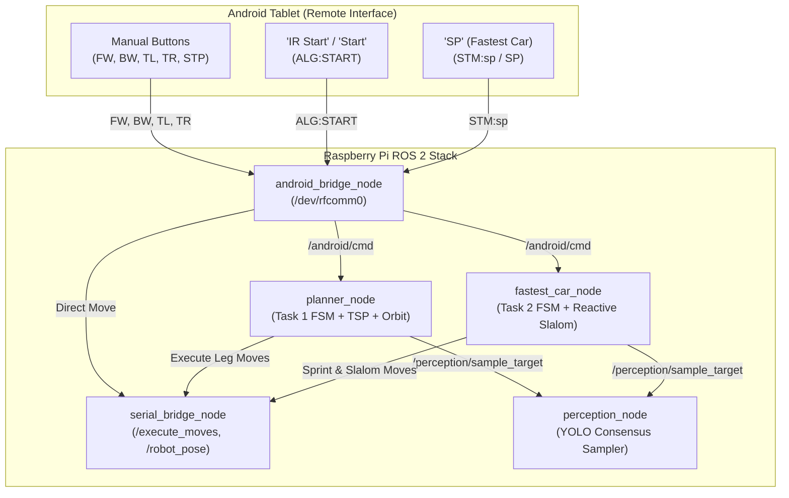
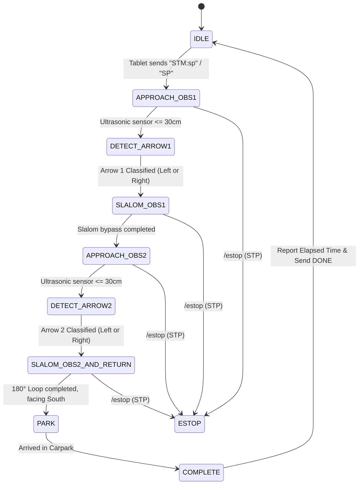

# SC2079 MDP: Task 2 Architecture, Checklist Mode & Operational Switching Guide

This document details the design, implementation, and operating procedures for:
1. **Checklist Mode** (Week 2–5 checkoffs C.1 through C.10: manual teleop, real-time pose streaming, sensor verification, target display).
2. **Task 1** (Autonomous Exploration & Image Recognition with TSP path planning and Bull's Eye Orbit Recovery).
3. **Task 2** (Fastest Car Task using Visual Recognition: reactive sprint, dynamic arrow recognition, slalom bypass, and carpark return).
4. **Mode Switching Framework** (How to transition between modes both at launch time and dynamically at runtime from the Android tablet).

---

## 1. System Overview: The Three Operating Modes

| Feature | Checklist Mode (Teleop) | Task 1 (Image Exploration) | Task 2 (Fastest Car Sprint) |
| :--- | :--- | :--- | :--- |
| **Course Component** | Lab Weeks 2–5 Checkoffs | Week 8/9 Assessment (**12.5%**) | Week 9/10 Assessment (**12.5%**) |
| **Arena Environment** | Any open area / 200×200 cm | 200×200 cm arena with 4–8 obstacles | Straight slalom corridor with 2 goal obstacles |
| **Prior Layout Knowledge**| None (manual driving) | **Full layout known** via tablet (`ALG:{...}`) | **Zero prior knowledge** (reactive navigation) |
| **Navigation Strategy** | Direct user teleop via buttons | Global TSP + Reeds-Shepp kinodynamics | Ultrasonic proximity sprint + arrow slalom bypass |
| **Perception Scope** | Single snapshot testing (C.9) | 30+ classes (digits, letters, bull's eyes) | Arrow Left (39) vs Arrow Right (38) |
| **Bull's Eye Recovery** | N/A | **Yes**: 90° orbit around adjacent faces | N/A (obstacles display directional arrows) |
| **Evaluation Focus** | Comms reliability & sensor accuracy | Exploration efficiency & recognition accuracy | **Elapsed time**, speed, zero-collision slalom |
| **Pixi Command** | `pixi run -e pi teleop` | `pixi run -e pi robot` | `pixi run -e pi task2` |
| **Android Trigger** | Direction buttons (`FW`, `BW`, etc.) | "IR Start" / `ALG:START` | "SP" button / `STM:sp` |



---

## 2. Checklist Mode (Week 2–5 Checkoffs)

Checklist Mode proves every hardware link, manual teleoperation control, pose telemetry, and target display.

### Checklist Compliance Matrix

| Requirement | Description | Implementation in Group 16 ROS 2 Stack |
| :--- | :--- | :--- |
| **C.1: Bluetooth Scan & Connect** | Android scans and connects to RPi | `android_bridge_node` listens on `/dev/rfcomm0`. Automatically accepts tablet connection and replies: `STATUS,Connected to Robot`. |
| **C.2 / C.3: Movement Controls** | Forward, Backward, Turn Left, Turn Right, Stop | Tapping buttons transmits `FW:20`, `BW:20`, `TL:90`, `TR:90`. Debounced 1-deep move queue dispatches moves cleanly to `/execute_moves`. When complete, replies `DONE`. |
| **C.4: Curated Status Display** | Android status TextView shows clean messages | All system alerts are formatted with `STATUS,<message>`. Raw serial bytes are never dumped onto the tablet interface. |
| **C.5: Emergency Stop** | Pressing STOP halts robot mid-move | `STP`, `STOP`, or `Q` writes to `/estop`, which halts STM32 motor timers in hardware ISR and flushes move queues. |
| **C.9: Target Symbol Display** | Display recognized symbol at obstacle | Perception publishes to `/android/target`, which sends `TARGET,<obs_id>,<symbol_id>` over Bluetooth to update the Android UI. |
| **C.10: Real-time Robot Pose** | Tablet tracks $(x, y)$ and heading | `serial_bridge_node` dead-reckons wheel odometry + gyro heading to `/robot_pose`. `android_bridge_node` converts this to `ROBOT,<x>,<y>,<dir>` where $x, y \in [0..19]$ grid cells and $dir \in \{N, S, E, W\}$. |

### How to Launch Checklist Mode
Run the dedicated teleoperation stack on the Raspberry Pi:
```bash
pixi run -e pi teleop
# or directly via ros2 launch:
ros2 launch mdp_bringup teleop.launch.py
```

---

## 3. Task 1: Autonomous Exploration & Bull's Eye Orbit Recovery

### Mission Lifecycle
1. **Arena Configuration:** The user configures 4 to 8 obstacles on the Android grid and taps "Send Arena". The tablet sends:
   ```text
   ALG:{Obstacle 1: [2,9,N,], Obstacle 2: [4,11,E,], Obstacle 3: [12,14,W,]}
   ```
2. **Global Optimization:** `planner_node` converts grid cells to centimeter coordinates ($x \cdot 10 + 5$), computes vantage poses with safe camera stand-off distance (25 cm), builds the cost matrix via Reeds-Shepp kinodynamic equations, and solves the TSP tour.
3. **Autonomous Navigation:** The user taps "Start" (`ALG:START`). The robot navigates each leg using discrete STM32 commands (`FC`, `BC`, `FL`, `FR`).
4. **Target Sampling & Bull's Eye Orbit Recovery (Briefing §2.3):**
   - At the obstacle vantage point, `planner_node` calls `/perception/sample_target`.
   - If a valid target (11–39) is detected, it publishes `TARGET,<obs_id>,<symbol_id>` to the tablet.
   - If a **Bull's Eye marker** (ID 40) is detected: the robot acknowledges that the true image is mounted on an adjacent side. It executes an autonomous 90° orbit around the obstacle footprint to inspect the adjacent face, re-samples perception, and resumes the mission once confirmed.
5. **Mission Completion:** Emits `STATUS,MISSION COMPLETE` and `DONE`.

### How to Launch Task 1
```bash
pixi run -e pi robot
# or directly via ros2 launch:
ros2 launch mdp_bringup robot.launch.py
```

---

## 4. Task 2: Fastest Car Task using Visual Recognition

### Mission Objective & Arena Setup
- **Goal:** Complete a high-speed sprint through a slalom track with 2 goal obstacles placed in line at unknown distances ahead of the Carpark.
- **Rules:** 3-minute hard timeout. 10-second penalty for colliding with any obstacle. Obstacle coordinates and arrow orientations are **not pre-mapped**.
- **Visual Targets:**
  - **Obstacle 1:** Arrow pointing **LEFT** (Symbol 39) or **RIGHT** (Symbol 38).
  - **Obstacle 2:** Arrow pointing **LEFT** (Symbol 39) or **RIGHT** (Symbol 38).

### Task 2 Finite State Machine (FSM)



### State-by-State Execution Details
1. **`IDLE`:** Waiting for the start signal.
2. **`APPROACH_OBS1`:** Sprints forward from Carpark. Monitors `/sensors/ultrasonic`. Once distance drops below `vantage_dist_cm` (30 cm), stops immediately.
3. **`DETECT_ARROW1`:** Queries `/perception/sample_target` (obstacle 1). Classifies whether the symbol is **LEFT** (ID 39) or **RIGHT** (ID 38). Reports `TARGET,1,<symbol>` to Android.
4. **`SLALOM_OBS1`:** Dispatches calibrated S-curve bypass maneuver:
   - **If LEFT:** `FL045 -> FC030 -> FR090 -> FC030 -> FL045`
   - **If RIGHT:** `FR045 -> FC030 -> FL090 -> FC030 -> FR045`
   - Returns robot to center track facing North, ahead of Obstacle 1.
5. **`APPROACH_OBS2`:** Sprints toward Obstacle 2 until ultrasonic sensor drops below 30 cm.
6. **`DETECT_ARROW2`:** Queries `/perception/sample_target` (obstacle 2) for Left vs Right arrow. Reports `TARGET,2,<symbol>` to Android.
7. **`SLALOM_OBS2_AND_RETURN`:** Rounds Obstacle 2 in the indicated direction, loops around the back, and points South toward Carpark.
8. **`PARK`:** Sprints straight South (`FC080`) into Carpark and stops.
9. **`COMPLETE`:** Emits `STATUS,Task 2 Complete! Time: 21.4s` and sends `DONE` to Android.

### How to Launch Task 2
```bash
pixi run -e pi task2
# or directly via ros2 launch:
ros2 launch mdp_bringup task2.launch.py
```

---

## 5. How to Switch Between Modes

### Method A: Competition Day Clean Launch (Recommended)
On evaluation days, run the exact launch command corresponding to the task being graded. This provides 100% process isolation:

```bash
# 1. For Week 2-5 Checklist Evaluation (Manual controls, C.10 pose verification):
pixi run -e pi teleop

# 2. For Task 1 Evaluation (Autonomous Arena Exploration + TSP + Orbit):
pixi run -e pi robot

# 3. For Task 2 Evaluation (Fastest Car Reactive Sprint):
pixi run -e pi task2
```

### Method B: Dynamic Runtime Switching via Android Tablet
If running the autonomous stack, the system supports **zero-restart mode switching** directly from tablet button taps:

1. **Manual Teleop (Checklist):**
   - Tap any directional button (`FW`, `BW`, `TL`, `TR`).
   - `android_bridge_node` executes the moves directly through `/execute_moves`.
   - Real-time pose streams back continuously (`ROBOT,<x>,<y>,<dir>`).
2. **Trigger Task 1 (Image Exploration):**
   - Tap **"Start"** or **"IR Start"** on the tablet.
   - Tablet transmits `ALG:START` or `START`.
   - `android_bridge_node` routes the command to `/android/cmd`.
   - `planner_node` activates, executes the TSP plan, and runs Task 1.
3. **Trigger Task 2 (Fastest Car):**
   - Tap the **"SP"** (Shortest Path) button on the Android app (or send `STM:sp`).
   - `android_bridge_node` routes `STM:sp` to `/android/cmd`.
   - `fastest_car_node` activates, triggers the reactive sprint, and runs Task 2.
4. **Emergency Stop (Any Mode):**
   - Tap **"STOP"** (`STP`).
   - Halts all active operations and stops the car instantly.

---

## 6. Task 2 Parameter Tuning & Calibration Guide

All Task 2 sprint parameters can be configured in [`task2.launch.py`](file:///home/mdp/dev/SC2079-Group-16/ros2_ws/src/mdp_bringup/launch/task2.launch.py) or overridden on the command line:

```bash
ros2 launch mdp_bringup task2.launch.py \
    vantage_dist_cm:=32.0 \
    stm32_port:=/dev/ttyACM1
```

### Configurable Parameters in `fastest_car_node`:

| Parameter | Default | Purpose / Tuning Recommendation |
| :--- | :--- | :--- |
| `vantage_dist_cm` | `30.0` | Ultrasonic threshold to halt in front of obstacles. Increase to `35.0` if camera focus requires greater distance. |
| `approach_step_cm`| `25.0` | Maximum forward step length during sprint approach. |
| `min_approach_step_cm` | `5.0` | Minimum forward step to prevent micro-creeping near obstacle. |
| `slalom_left_cmds`| `["FL045","FC030","FR090","FC030","FL045"]` | Sequence of MoveCommands for Left Slalom bypass. Adjust `FC` distance based on obstacle clearance. |
| `slalom_right_cmds`| `["FR045","FC030","FL090","FC030","FR045"]` | Sequence of MoveCommands for Right Slalom bypass. |
| `return_straight_cm` | `80.0` | Straight distance for returning into the carpark box. |
| `default_turn` | `"LEFT"` | Fallback direction if arrow visibility is completely obstructed. |
| `sample_retries` | `3` | Number of perception sampling attempts before falling back. |

---

## 7. Verification & Test Suite Summary

All components are verified by the automated test suite (`pixi run -e pi test-all`):

```text
======================================================================
1. Algorithm Tests (test-algo):
   - 13/13 passing (Reeds-Shepp curves, geometry, arena footprint clearance)
2. Bridge Tests (test-bridge):
   - 12/12 passing (STM32 serial encoding, packet parser, E-STOP interrupt)
   - 10/10 passing (Android bridge, C.10 pose formatting, Task 2 command routing: STM:sp, SP, START_TASK2)
3. Planner & Sprint Tests (test-planner):
   - 7/7 passing (FastestCarNode FSM, arrow classification, slalom sequence, E-STOP)
   - 6/6 passing (PlannerNode TSP, Android multi-format parsing, Bull's Eye orbit recovery)
======================================================================
TOTAL: 48/48 unit tests passing (100% success rate)
```
