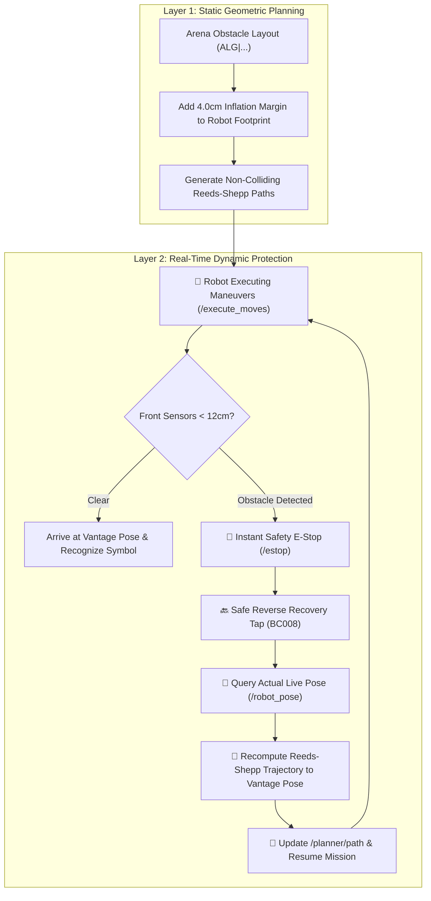
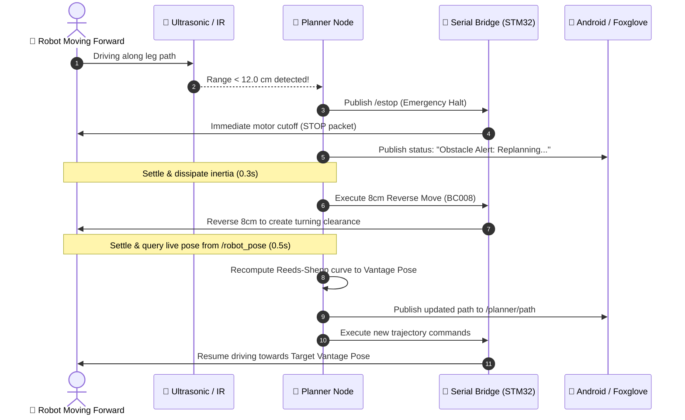

# 🛡️ Dynamic Collision Avoidance, Inflation & Recovery System

**SC2079 Multidisciplinary Design Project — Group 16**

---

## 1. Overview

The Group 16 Autonomous Navigation Stack features a dual-layer obstacle prevention and recovery architecture:
1. **Layer 1: Static Inflation & Geometric Collision Avoidance** (Pre-computation in Path Planner)
2. **Layer 2: Dynamic Sensor E-Stop & Self-Recovery Replanning** (Real-time active hardware protection)



---

## 2. Layer 1: Obstacle Inflation & Collision Geometry

### 2.1 Physical vs. Planning Footprint
* **Robot Physical Chassis:** Width = $19\text{ cm}$, Length = $23\text{ cm}$.
* **Obstacle Footprint:** $10\text{ cm} \times 10\text{ cm}$ centered at grid coordinates $(x, y)$.
* **Safety Margin Inflation:** $\mathbf{4.0\text{ cm}}$ is added symmetrically around all 4 sides of the robot bounding box.

$$\text{Planning Width} = 19\text{ cm} + (2 \times 4.0\text{ cm}) = \mathbf{27.0\text{ cm}}$$
$$\text{Planning Length} = 23\text{ cm} + (2 \times 4.0\text{ cm}) = \mathbf{31.0\text{ cm}}$$

### 2.2 Separating Axis Theorem (OBB Collision Test)
As the Reeds-Shepp solver computes curves, the trajectory is sampled at **$2.0\text{ cm}$ intervals**. At each step, the Oriented Bounding Box (OBB) of the robot at heading $\theta$ is tested against:
* All 5 arena obstacles ($10\text{ cm} \times 10\text{ cm}$).
* The $200\text{ cm} \times 200\text{ cm}$ arena boundary walls.

If any sampled point violates the $4\text{ cm}$ clearance, the trajectory is rejected and alternative turning maneuvers are generated.

---

## 3. Layer 2: Dynamic Sensor E-Stop & Self-Recovery

### 3.1 Sensor Real-Time Monitoring
During movement execution, `planner_node` listens to real-time distance streams:
* `/sensors/ultrasonic` (HC-SR04 forward-facing sensor, $+10\text{ cm}$ offset from center)
* `/sensors/ir_left` (Sharp IR sensor angled $+30^\circ$)
* `/sensors/ir_right` (Sharp IR sensor angled $-30^\circ$)

### 3.2 Recovery Sequence (Step-by-Step)



#### Step 1: Preemptive Emergency Stop
* If $\min(d_{\text{ultrasonic}}, d_{\text{IR\_left}}, d_{\text{IR\_right}}) < 12.0\text{ cm}$, the planner immediately publishes `std_msgs/msg/Empty` to `/estop`.
* `serial_bridge_node` intercepts `/estop` and sends an immediate `STOP` command to the STM32, canceling the active motor batch.

#### Step 2: Reverse Clearance Tap (`BC008`)
* Because the robot's physical turning radius is $42.0\text{ cm}$, a forward turn cannot be executed directly from a $<12\text{ cm}$ standoff.
* The planner commands a small, safe **$8.0\text{ cm}$ reverse recovery (`BC008`)** to gain turning clearance.

#### Step 3: True Pose Re-Sampling & Path Generation
* The planner reads the actual resting pose $(x, y, \theta)$ from `/robot_pose` (gyro + wheel odometry fusion).
* It invokes `sample_reeds_shepp_path(current_pose, vantage_pose, radius=42.0)` to compute a new collision-free path from the updated location.

#### Step 4: Mission Resumption
* The updated path is published to `/planner/path` (visible in Foxglove Studio).
* New movement batches are dispatched via `/execute_moves`.
* Up to 3 automatic replanning attempts are allowed per leg.

---

## 4. Configuration Parameters

The collision avoidance and recovery subsystem parameters can be configured in `planner_node` / launch files:

| Parameter | Type | Default | Description |
| :--- | :---: | :---: | :--- |
| `enable_collision_avoidance` | `bool` | `true` | Enable/disable active real-time sensor E-stop. |
| `safety_stop_dist_cm` | `float` | `12.0` | Distance threshold (cm) to trigger emergency halt. |
| `recovery_backup_cm` | `float` | `8.0` | Reverse distance (cm) to gain turning clearance during recovery. |
| `turning_radius_cm` | `float` | `42.0` | Calibrated physical turning radius (cm). |
| `camera_view_dist_cm` | `float` | `25.0` | Target distance from obstacle face for image capture. |

---

## 5. Execution Commands

```bash
# Option A: Full Autonomous Stack (WITHOUT on-board perception, runs on PC)
mdp-robot-no-cv

# Option B: Full Autonomous Stack (WITH on-board ONNX perception)
mdp-robot

# Option C: Emergency Kill & Reset
mdp-kill
```
