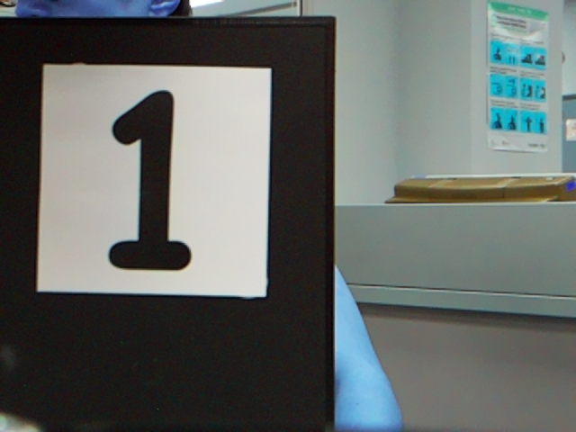
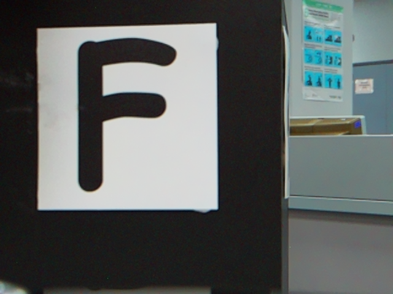

# CV results and physical-test evidence

This is the result register for the September 2026 CV workflow. Results below are
historical, not new tests performed for this documentation change. Read
[history](history.md) for training/data decisions and
[the evidence policy](evidence/README.md) for provenance and redaction details.

## 1. Evidence levels

| Level | What was actually exercised | What it does not establish |
|---|---|---|
| Dataset evaluation | Predictions against the existing validation/test annotations | Independent field accuracy when duplicates/provenance problems remain |
| Local contract/simulation | Class mapping, publication rules and mathematical behavior | Pi runtime behavior or physical motion |
| Pi saved-image benchmark | Real ONNX CPU inference on earlier Pi images | Fresh lighting, camera exposure, movement or new views |
| Pi ROS replay | Real Pi inference plus ROS scheduling, confirmation and publication using repeated saved images | New physical observations |
| Stationary physical service test | A real card or background through the live Pi camera, followed by a sample request | Automatic publication or broad class coverage |
| Stationary physical automatic test | Fresh live camera frames and automatic confirmed publication | Full autonomous mission or recognition while driving |

The recorded physical work used a stationary setup. The operator confirmed motor
power was disabled while the Pi/camera remained powered. This is an operator
confirmation, not a log measurement of the electrical state.

## 2. Completed training runs

| Item | Nano | Medium |
|---|---|---|
| Architecture / initial weights | YOLOv8n / `yolov8n.pt` | YOLOv8m / `yolov8m.pt` |
| Job ID | `6aa027d5900620b5c77e29ad` | `6aa3621921047bf1b03747ec` |
| Run name | `baseline-yolov8n-v61-full-20260908T142129Z-r2` | `baseline-yolov8m-v61-full-20260911T013018Z` |
| GPU | Tesla T4, `t4-small` | One L4, `l4x1` |
| Maximum / completed epochs | 180 / 129 | 180 / 118 |
| Selected best epoch | 99 | 88 |
| Running time | 34,422 s; 9 h 33 m 42 s | 16,835 s; 4 h 40 m 35 s |
| Historical estimated compute | US$3.82 | US$3.74 |
| ONNX bytes | 12,288,971 | 103,694,827 |
| ONNX size | 11.72 MiB | 98.89 MiB |

Sources: [nano completion](evidence/2026-09-09/nano-training-summary.json),
[medium training hardware](evidence/2026-09-11/medium-training-plan.json), and
[medium completion](evidence/2026-09-14/medium-completion-summary.json).
Costs are stored historical estimates at the submission/completion rate, not a
current quote or account invoice. They do not include every failed attempt or
other account charge. Running times can include preparation/evaluation/export;
the different GPUs prevent a controlled architecture-only speed comparison.

### Dataset metrics

| Metric | Nano best-epoch validation | Medium validation evaluation | Medium test evaluation |
|---|---:|---:|---:|
| Precision | 0.99233 | 0.9888787 | 0.9881386 |
| Recall | 0.98818 | 0.9899578 | 0.9909494 |
| mAP50 | 0.99317 | 0.9923263 | 0.9935452 |
| mAP50–95 | 0.98389 | 0.9841807 | 0.9859339 |

These are detection metrics against the existing annotations. Both full runs used
the original split, containing 25 exact-duplicate cross-split groups, annotation
conflicts, unverified empty labels and unknown session provenance. They must not
be presented as a probability of correct recognition of the next physical card.
A separate full nano test-set score is not asserted: the cited nano completion
record provides validation metrics.

Medium's validation mAP50–95 is only about 0.00029 higher than nano's recorded
value, or 0.029 percentage points. Some other metrics are lower. Different
evaluation stages and unresolved leakage prevent a claim of meaningful field
superiority from this difference.

### Exact model identities

| Artifact | SHA-256 |
|---|---|
| Nano `best.pt` | `e490a7ca853d0c0d8b0e48efdf9a08e7b7c490150b291dc44f6aca77145d250f` |
| Nano `last.pt` | `52c2dc6306fa7b51b8c469efccbd68a6472feb275e82735579c2442fae60cc01` |
| Nano `best.onnx` | `0207a7fb6ab117ce0a62fd683185da8d8ca065c92f1a0ee1d155e65f14e2c48a` |
| Medium `best.pt` | `32224e5c6bf789784be1b8d34c7be6b84698d945c6b2f0d73d604218b290d08e` |
| Medium `last.pt` | `390c7c68623664fcf5183462da0858c116a9c2ab96dcf450dbe3a3e8906411cf` |
| Medium `best.onnx` | `37329aa47f45f324e97945a8e85dea23b59e41c29ab1594aec894daf62aef031` |

The packaged inference files are [nano](../../models/cv-baselines/nano/best.onnx)
and [medium](../../models/cv-baselines/medium/best.onnx). They require Git LFS
materialization before inference; a small pointer text file is not the model.
Check both size and checksum. The two ONNX exports share canonical class order,
static FP32 input `[1,3,640,640]` and output `[1,35,8400]`, with opset 18 and no
embedded NMS. Six medium test images showed PyTorch/ONNX maximum absolute output
differences of approximately 0.000427–0.000992. Numerical parity is not another
accuracy measurement.

## 3. Physical nano diagnosis: retain the failed tests

The first digit 1 attempt and retry received live camera images at about 15 FPS
but returned `UNCERTAIN`, ID 0, and no accepted target. Their service round-trip
times were approximately 893 and 874 ms. See the
[first attempt](evidence/2026-09-09/stationary/digit1-result.json) and
[retry](evidence/2026-09-09/stationary/digit1-retry-result.json).

The same saved original frame also failed through both PyTorch and ONNX
diagnostics. Inverting the saved image produced ID 11 at confidence 0.94399;
a dataset reference produced ID 11 at 0.93843. This
[appearance diagnosis](evidence/2026-09-09/stationary/digit1-appearance-diagnostic.json)
supported the user's observation that the live cards were black on white. It was
initially a saved-image experiment; successful physical tests came afterward.

### Physical service-driven retests with inversion

| Case | Obstacle | Expected / observed | Confidence | Round trip | Accepted message |
|---|---:|---|---:|---:|---|
| Digit 1, original | 1 | 11 / uncertain | 0 | 893 ms | None |
| Digit 1, original retry | 1 | 11 / uncertain | 0 | 874 ms | None |
| Digit 1, inversion | 1 | 11 / 11 | 0.9520 | 1,230 ms | `1,11` |
| F, inversion | 2 | 25 / 25 | 0.9361 | 1,180 ms | `2,25` |
| Background, inversion | 3 | None / uncertain | 0 | 1,118 ms | None |

The successful records are [digit 1](evidence/2026-09-09/stationary/digit1-live-inverted-result.json),
[F](evidence/2026-09-09/stationary/letter-f-live-inverted-result.json), and
[background](evidence/2026-09-09/stationary/background-live-inverted-result.json).
Service round-trip time includes work beyond ONNX inference.

This unmodified original-color frame was received immediately before the successful
service request. The record explicitly says it is **not guaranteed to be the exact
inference frame**. Distance, illumination and exposure were not measured in these
records. Two correctly recognized symbols and one rejected scene do not establish
all-symbol accuracy or a general background false-positive rate.

The later live candidate applied inversion once inside inference, preserving the
original camera topic and evidence colors. Combining that setting with an external
inversion publisher would invert twice. The tested adaptation does not establish
robustness to every background, print type or lighting condition.

## 4. Automatic live recognition: what changed

The initial service returned an answer when asked. The live candidate instead
retained the newest image and attempted inference on a timer. A target required:

1. A fresh, previously unprocessed image.
2. Valid inference under the canonical class contract and confidence threshold.
3. The same official ID in three successive processed observations.
4. Valid timing/obstacle association and no active duplicate suppression.

Misses or stale observations broke confirmation. Holding the same card after
acceptance suppressed repeat messages. Sustained observed absence, a newly
confirmed different symbol, or an obstacle change could rearm acceptance. An
obstacle change invalidated previous work and required new frames.

“Three frames” means three processed observations, not three timer ticks reusing
one image and not three camera frames arriving at 15 FPS. Receipt/publication
timestamps provide freshness checks; they do not independently verify the sensor's
exposure time when capture buffering is possible.

| Recorded parameter | Nano | Medium |
|---|---:|---:|
| Requested inference FPS limit | 4.0 | 1.0 |
| Confidence threshold | 0.50 | 0.50 |
| Confirmation observations | 3 | 3 |
| ONNX threads | 2 | 4 |
| Invert colors | Yes | Yes |
| Maximum input age | 1 s | 1 s |
| Maximum result age | 2.5 s | 8 s |
| Maximum confirmation gap | 3 s | 8 s |
| Absence reset duration | 2 s | 2 s |
| Result topic in cited run | `/test/android/target` | `/test/medium/fixtures/target` |

Sources: [nano run configuration](evidence/2026-09-09/live/run-config.json) and
[medium replay configuration](evidence/2026-09-14/replay/run-config.json).
These are historical test profiles, not measurements of current active settings.
The medium replay used `/test/medium/fixtures/image_raw` and its matching fixture
result topic; the separately staged physical profile used `/test/medium/android/target`.
The larger medium result deadline permits several-second-old stationary results;
it is not a validated profile for scene interpretation during driving.

### Pi saved-image behavior replay

Both candidate runtimes were tested by publishing earlier Pi images at 10 FPS and
performing real ONNX inference on the Pi. The seven checked behaviors were automatic
publication without service calls, three-frame confirmation, held-card duplicate
suppression, background rejection, rearming after absence, symbol switching and
obstacle-change reset.

| Event | Message | Nano elapsed | Medium elapsed |
|---|---|---:|---:|
| First F | `1,25` | 3.18 s | 16.65 s |
| F reappears | `1,25` | 19.73 s | 66.79 s |
| Change to digit 1 | `1,11` | 23.86 s | 83.06 s |
| Obstacle changes to 2 | `2,11` | 27.10 s | 97.70 s |

See [nano replay](evidence/2026-09-09/replay-result.json) and
[medium replay](evidence/2026-09-14/replay/replay-result.json). Times are measured
from the start of each multi-phase replay; later rows include earlier phases and
must not all be reported as independent card-recognition delays.

### Actual physical automatic F test

The operator presented F. The nano runtime automatically published `1,25` after
three processed observations, without a sample request. Its
[accepted event](evidence/2026-09-09/live/1788933672803107938-obs1-id25.json) and
[validation summary](evidence/2026-09-09/live/validation-summary.json) record:

| Measurement | Value |
|---|---:|
| Official symbol ID | 25 |
| Confidence | 0.9241 |
| Confirmation count at acceptance | 3 |
| Inference time for accepted observation | 937.8 ms |
| Frame receipt to result | 951.4 ms |
| Requested FPS cap | 4.0 |
| Recent measured throughput | 1.041 FPS |
| Recent median inference | 913.7 ms |
| Total retained processed observations | 142 |
| Accepted publications in that log | 1 |

This is the exact saved original frame for the accepted live event. It is distinct
from the earlier service test's nearby diagnostic image. The
[142-row observation log](evidence/2026-09-09/live/observations.jsonl) spans about
133 seconds, beginning at `2026-09-09T06:01:10.900Z`. Later held-F observations
were suppressed. The whole-log median inference is approximately 913.4 ms; the
summary's recent-window median is 913.7 ms.

This establishes automatic live recognition and duplicate suppression for that
scene. The 142 observations are not 142 independent field trials. The saved summary
explicitly sets `mission_release_ready` to false. Manual obstacle ID 1 does not
demonstrate autonomous obstacle association or delivery to the Android tablet.

## 5. Pi resource and latency comparison

The [standalone benchmark](evidence/2026-09-14/pi-benchmark.json) used nine
post-warm-up inferences per configuration across saved digit 1, F and background
images. All recorded expected decisions passed for those three scenes.

| Context | Threads | Median inference | Min–max | Throughput meaning |
|---|---:|---:|---:|---|
| Nano saved-image benchmark | 2 | 851.9 ms | 846.8–861.8 ms | About 1.17 images/s compute ceiling |
| Medium saved-image benchmark | 2 | 4,843.5 ms | 4,834.1–5,551.6 ms | About 0.21 images/s compute ceiling |
| Medium saved-image benchmark | 4 | 3,766.1 ms | 3,624.7–3,895.0 ms | About 0.27 images/s compute ceiling |
| Nano physical live summary | 2 | 913.7 ms | Retained log | 1.041 FPS observed recently |
| Medium final ROS replay | 4 | 4,377.8 ms | 4,168.2–5,329.0 ms | 0.1985 FPS observed |

A compute ceiling is the reciprocal of inference duration and excludes overhead.
It is not an observed end-to-end FPS. Medium/4 threads was approximately 4.4 times
slower than nano/2 threads in the standalone comparison and the ONNX file was 8.44
times larger. This supports retaining nano as the responsive stationary candidate;
it does not establish equal accuracy on untested symbols.

The benchmark records peak RSS as **native units**: 206,180 for nano and roughly
405,000–408,000 for medium. These fields are not relabeled as megabytes. The source
identifies `aarch64`; project documentation targets a Pi 4B. The benchmark alone
does not establish measured RAM capacity or hardware revision. Temperature,
throttling and system-wide load were not adequately recorded to establish a
long-duration resource profile.

Earlier medium replay attempts exceeded result deadlines under load, with roughly
8–11-second inference reported in deployment notes. The runtime withheld stale
results. The final successful result should not conceal those earlier failures or
be presented as a guarantee of 3.8-second inference on every run.

The final worker test deliberately blocked inference, generated 100 timer ticks,
changed the obstacle assignment and checked bounded work plus rejection of the
outdated result. The [completion summary](evidence/2026-09-14/medium-completion-summary.json)
records that worker test passing, as well as 29 local contract/loader/confirmation
tests. The worker fixes scheduling, not the underlying compute cost.

The final medium replay retained 22 processed observations and four acceptance
events. **Fresh physical medium camera validation is not in this evidence set.**
The previous recommendation to hold a medium-test card for 20 seconds and remove
it for 15 seconds was derived from replay timing, not a completed physical test.

## 6. Open validation work

| Question | Evidence still needed |
|---|---|
| Does medium work on fresh real scenes? | Stationary live camera trials with the verified medium model and profile |
| Do all 30 official symbols work? | Independently reset, labeled physical trials across all classes |
| Is rejection reliable? | Marker-only, blank, clutter, occluded and multiple-symbol trials with measured durations |
| Is the dataset a clean holdout? | Corrected annotations and original-image/session grouping before re-splitting |
| Does recognition work during motion? | Calibrated camera timing, controlled moving tests, correct obstacle/face association and stale-result checks |
| Does Android show the correct target? | End-to-end production-topic/RFCOMM/UI evidence, not only `/test/...` messages |
| Does bullseye approach/orbit work physically? | Separate navigation validation described in [bullseye status](bullseye-status.md) |
| Are old Pi files/processes still present? | A dated inspection of the intended device; historical snapshots and receipts are insufficient |

For future trials, record session ID, source commit, model SHA, runtime parameters,
ground truth, obstacle/face, distance/angle, lighting, accepted ID, confidence,
time to first correct acceptance, wrong accepts, no-result/timeouts, duplicates and
evidence filenames. Keep failures in the denominator. Report per-class success,
confusion, false accepts over background observation time and acceptance-delay
distributions. This is a proposed evidence standard, not a claim that these trials
have already been completed.
