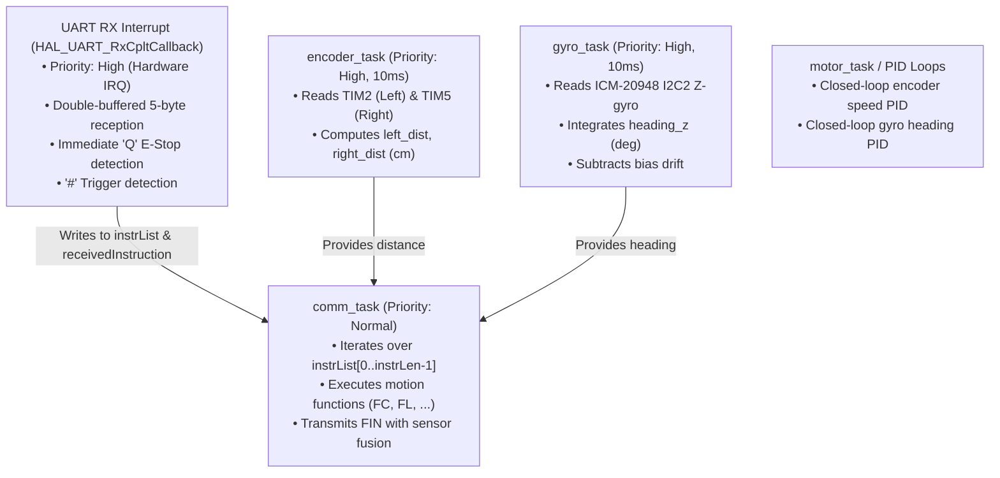
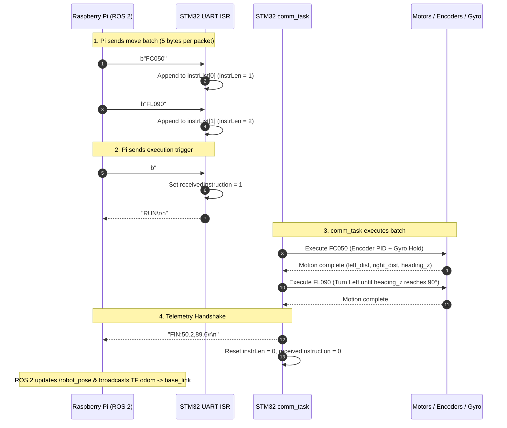
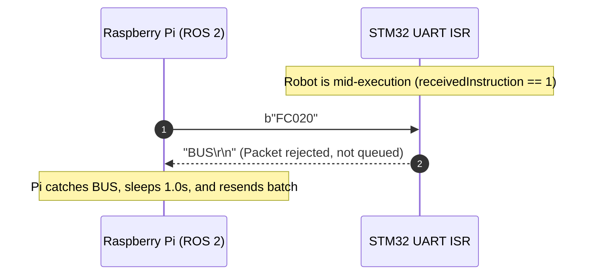
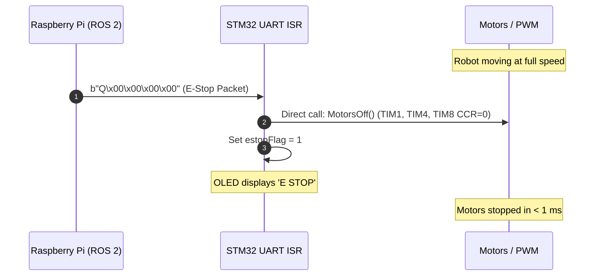

# STM32F407 ↔ Raspberry Pi 4B UART Communication & Control Specification
**SC2079 Multidisciplinary Project — Group 16**  
**Document Version:** 2.0 (Comprehensive Engineering Reference)  
**Target Hardware:** STM32F407VET6 (Core MCU) $\longleftrightarrow$ Raspberry Pi 4B (ROS 2 Host)  
**Author / Maintainers:** MDP Group 16 Integration Team  

---

## Table of Contents
1. [Physical & Electrical Specifications](#1-physical--electrical-specifications)
2. [FreeRTOS Task & Concurrency Architecture](#2-freertos-task--concurrency-architecture)
3. [Serial Packet Layer (RPi $\rightarrow$ STM32)](#3-serial-packet-layer-rpi--stm32)
   - [3.1 Instruction Packets](#31-instruction-packets)
   - [3.2 Trigger Packet](#32-trigger-packet)
   - [3.3 Asynchronous Emergency Stop (E-Stop) Packet](#33-asynchronous-emergency-stop-e-stop-packet)
   - [3.4 Complete Command Reference Table](#34-complete-command-reference-table)
4. [Response & Sensor Telemetry Layer (STM32 $\rightarrow$ RPi)](#4-response--sensor-telemetry-layer-stm32--rpi)
   - [4.1 Status Signals (`RUN`, `BUS`, `FUL`)](#41-status-signals-run-bus-ful)
   - [4.2 Sensor-Fused Feedback (`FIN:<dist>,<heading>`)](#42-sensor-fused-feedback-findistheading)
5. [State Machine & Sequence Diagrams](#5-state-machine--sequence-diagrams)
   - [5.1 Nominal Batch Execution Flow](#51-nominal-batch-execution-flow)
   - [5.2 Collision / Busy Rejection Flow](#52-collision--busy-rejection-flow)
   - [5.3 Mid-Flight Emergency Stop Flow](#53-mid-flight-emergency-stop-flow)
6. [Firmware Implementation Blueprint (C Code)](#6-firmware-implementation-blueprint-c-code)
   - [6.1 Volatile Shared State & Buffers](#61-volatile-shared-state--buffers)
   - [6.2 UART RX Interrupt Service Routine (ISR)](#62-uart-rx-interrupt-service-routine-isr)
   - [6.3 `comm_task` Loop & Dispatch](#63-comm_task-loop--dispatch)
   - [6.4 `EStop()` Hardware Safety Routine](#64-estop-hardware-safety-routine)
7. [Sensor Fusion & Calibration Formulas](#7-sensor-fusion--calibration-formulas)
   - [7.1 Optical Encoders to Centimeters](#71-optical-encoders-to-centimeters)
   - [7.2 ICM-20948 Gyro Integration & Drift Compensation](#72-icm-20948-gyro-integration--drift-compensation)
8. [Bench Testing & Verification Guide](#8-bench-testing--verification-guide)

---

## 1. Physical & Electrical Specifications

The STM32 board communicates with the Raspberry Pi over a full-speed USB-to-UART / USB-CDC connection (USART3 peripheral mapped to an onboard CH340/CH343 or ST-Link CDC interface).

| Parameter | Specification | Notes |
|---|---|---|
| **Physical Connector** | Micro-USB / USB-C to USB-A | Connects directly to RPi 4B USB 2.0 / 3.0 port |
| **Linux Device Node** | `/dev/ttyACM0` or `/dev/ttyUSB0` | Automatically discovered by `serial_bridge_node` |
| **Baud Rate** | `115200` bps | Standard UART clock rate |
| **Data Bits** | `8` | Standard 8-bit word |
| **Parity** | `None` | `UART_PARITY_NONE` |
| **Stop Bits** | `1` | `UART_STOPBITS_1` |
| **Flow Control** | `None` | No RTS/CTS or software flow control |
| **Endianness / Encoding** | Standard ASCII (US-ASCII) | Numbers formatted as base-10 ASCII digits |

---

## 2. FreeRTOS Task & Concurrency Architecture

The firmware runs FreeRTOS with preemptive scheduling across dedicated tasks:



---

## 3. Serial Packet Layer (RPi $\rightarrow$ STM32)

Every packet sent from the Raspberry Pi to the STM32 is **strictly fixed at 5 bytes**. No newline characters (`\r` or `\n`) are appended during queue population.

### 3.1 Instruction Packets: `[CMD0][CMD1][DIG0][DIG1][DIG2]`
- **Bytes 0–1 (`CMD`):** 2-character ASCII command code.
- **Bytes 2–4 (`VAL`):** 3-digit zero-padded ASCII integer (`000`–`999`).
- **Parsing logic on STM32:**
  ```c
  uint16_t cmd_code = (((uint16_t)pkt[0]) << 8) | (pkt[1] & 0xFF);
  int value = atoi((char *)&pkt[2]); // parses exactly the 3 digits
  ```

### 3.2 Trigger Packet: `b"#\x00\x00\x00\x00"`
- **Byte 0:** ASCII `'#'` (`0x23`)
- **Bytes 1–4:** Null bytes (`0x00, 0x00, 0x00, 0x00`)
- **Role:** Signals the STM32 that the batch queue is complete. The STM32 sends `RUN\r\n` and immediately starts executing queued commands in FIFO order.
- **Note:** The `#` packet itself is **never** added to the instruction queue (`instrList`).

### 3.3 Asynchronous Emergency Stop (E-Stop) Packet: `b"Q\x00\x00\x00\x00"`
- **Byte 0:** ASCII `'Q'` (`0x51`)
- **Bytes 1–4:** Null bytes (`0x00, 0x00, 0x00, 0x00`)
- **Role:** Handled **directly inside the UART RX interrupt handler** (`HAL_UART_RxCpltCallback`).
- **Safety guarantee:** Cuts PWM duty cycles to zero within $< 1\text{ ms}$, bypassing FreeRTOS scheduling and clearing active execution.

---

### 3.4 Complete Command Reference Table

| Code | Format | Value Range | Units | Behavior & Physical Execution | Example |
|---|---|---|---|---|---|
| `FC` | `FC<val>` | `000`–`999` | Centimeters | Drive **Forward Center** (straight). Uses encoder PID and gyro heading hold. | `FC050` (50 cm straight) |
| `BC` | `BC<val>` | `000`–`999` | Centimeters | Drive **Backward Center** (straight). Reverses motors with gyro hold. | `BC020` (20 cm reverse) |
| `FL` | `FL<val>` | `000`–`360` | Degrees | Steer wheels left, drive forward until integrated gyro reaches `+val` deg. | `FL090` (turn left 90°) |
| `FR` | `FR<val>` | `000`–`360` | Degrees | Steer wheels right, drive forward until integrated gyro reaches `-val` deg. | `FR090` (turn right 90°) |
| `BL` | `BL<val>` | `000`–`360` | Degrees | Steer wheels left, reverse until integrated gyro reaches `-val` deg. | `BL045` (reverse-left 45°) |
| `BR` | `BR<val>` | `000`–`360` | Degrees | Steer wheels right, reverse until integrated gyro reaches `+val` deg. | `BR045` (reverse-right 45°) |
| `FU` | `FU<val>` | `000`–`999` | Centimeters | Drive forward until ultrasonic sensor reads $\le \text{val}$ cm from obstacle/wall. | `FU020` (stop 20 cm from wall) |
| `BU` | `BU<val>` | `000`–`999` | Centimeters | Drive backward until ultrasonic sensor reads $\le \text{val}$ cm from obstacle/wall. | `BU020` |
| `TO` | `TO000` | `000` | None | Diagnostic 10-second timeout delay without motor power. Safe for comms test. | `TO000` |
| `GC` | `GC000` | `000` | None | Gyro bias calibration (samples gyro for 4.0s stationary) and zeroes heading. | `GC000` |
| `G0` | `G0000` | `000` | None | Zeroes current `heading_z` without recalibrating bias. | `G0000` |

---

## 4. Response & Sensor Telemetry Layer (STM32 $\rightarrow$ RPi)

All messages sent from the STM32 back to the Raspberry Pi are standard ASCII strings terminated with `\r\n` (`0x0D, 0x0A`).

```
+-------------------------------------------------------------+
| Response Code | Full Message Format        | Payload Type   |
+---------------+----------------------------+----------------+
| RUN           | "RUN\r\n"                  | Status (5 B)   |
| FIN           | "FIN:<dist>,<heading>\r\n" | Telemetry (var)|
| BUS           | "BUS\r\n"                  | Status (5 B)   |
| FUL           | "FUL\r\n"                  | Status (5 B)   |
+-------------------------------------------------------------+
```

### 4.1 Status Signals (`RUN`, `BUS`, `FUL`)

1. **`RUN\r\n` (5 bytes):**
   - Transmitted by the UART ISR immediately upon receiving a valid `#` trigger.
   - Informs the Pi that the batch has been accepted and motor execution has commenced.

2. **`BUS\r\n` (5 bytes):**
   - Transmitted if the Pi sends any instruction or trigger packet while `receivedInstruction == 1` (STM32 is already running a batch).
   - **Crucial Rule:** The incoming packet is **rejected and NOT stored** in `instrList`. The Pi will pause for 1.0s and retry.

3. **`FUL\r\n` (5 bytes):**
   - Transmitted if the Pi attempts to send more than 40 commands before sending a `#` trigger.
   - The overflow packet is **rejected and NOT stored**.

---

### 4.2 Sensor-Fused Feedback (`FIN:<dist>,<heading>`)

When all instructions in the batch have physically executed and the robot has come to a complete stop, `comm_task` sends back the telemetry string:

$$\mathbf{FIN:\langle dist\_cm\rangle,\langle heading\_deg\rangle\backslash r\backslash n}$$

#### Fields:
- `dist_cm` (`float`, `%.1f` format): The actual average displacement measured by the wheel optical encoders during the batch:
  $$\text{dist\_cm} = \frac{\text{left\_dist} + \text{right\_dist}}{2.0}$$
- `heading_deg` (`float`, `%.1f` format): The actual integrated Z-gyro heading in degrees from the ICM-20948 IMU (`heading_z`).

#### Telemetry Examples:
- `FIN:50.2,0.4\r\n` $\rightarrow$ Robot drove forward $50.2\text{ cm}$; final gyro heading is $+0.4^\circ$.
- `FIN:0.0,89.6\r\n` $\rightarrow$ Robot executed a 90° left turn; final gyro heading is $+89.6^\circ$.
- `FIN:-20.1,0.0\r\n` $\rightarrow$ Robot reversed $20.1\text{ cm}$.

*(Backward Compatibility: If an older firmware binary transmits plain `FIN\r\n`, the ROS 2 node automatically falls back to nominal kinematic dead reckoning).*

---

## 5. State Machine & Sequence Diagrams

### 5.1 Nominal Batch Execution Flow


---

### 5.2 Collision / Busy Rejection Flow


---

### 5.3 Mid-Flight Emergency Stop Flow


---

## 6. Firmware Implementation Blueprint (C Code)

Below are the exact, tested C code implementations for the STM32F407 Cube HAL / FreeRTOS environment.

### 6.1 Volatile Shared State & Buffers
Place in `stm32/src/main.c` (global scope):

```c
/* Double-buffered UART reception to prevent race conditions during back-to-back packets */
static volatile uint8_t rxBuffer[2][5];
static volatile uint8_t rxIdx = 0;

/* Instruction queue: up to 40 5-byte commands */
volatile uint8_t instrList[40][5];
volatile uint8_t instrLen = 0;
volatile uint8_t receivedInstruction = 0;
volatile uint8_t estopFlag = 0;

/* Telemetry measurements (updated by encoder_task and gyro_task) */
extern float left_dist;
extern float right_dist;
extern float heading_z;
```

---

### 6.2 UART RX Interrupt Service Routine (ISR)
Implement in `main.c` or `stm32f4xx_it.c`:

```c
void HAL_UART_RxCpltCallback(UART_HandleTypeDef *huart)
{
    if (huart->Instance == USART3)
    {
        uint8_t *pkt = (uint8_t *)rxBuffer[rxIdx];

        /* Re-arm reception immediately on the alternate buffer */
        rxIdx ^= 1;
        HAL_UART_Receive_IT(&huart3, (uint8_t *)rxBuffer[rxIdx], 5);

        /* If latched in E-Stop, ignore all further packets until reboot */
        if (estopFlag) return;

        if (pkt[0] == 'Q')
        {
            EStop(); /* Cut motors immediately inside ISR */
        }
        else if (pkt[0] == '#')
        {
            receivedInstruction = 1;
            HAL_UART_Transmit(&huart3, (uint8_t *)"RUN\r\n", 5, 0xFFFF);
        }
        else if (instrLen >= 40)
        {
            HAL_UART_Transmit(&huart3, (uint8_t *)"FUL\r\n", 5, 0xFFFF);
        }
        else if (receivedInstruction == 1)
        {
            HAL_UART_Transmit(&huart3, (uint8_t *)"BUS\r\n", 5, 0xFFFF);
        }
        else
        {
            /* Store 5-byte instruction into queue */
            memcpy((void *)instrList[instrLen], pkt, 5);
            instrLen++;
        }

        /* Diagnostic OLED feedback */
        sprintf((char *)oled_display[3], "Rx:%.5s", pkt);
    }
}
```

---

### 6.3 `comm_task` Loop & Dispatch
Implement in `main.c`:

```c
void comm_task(void *argument)
{
    uint8_t cur_inst[5];
    int instr_value = 0;

    for (;;)
    {
        if (estopFlag)
        {
            MotorsOff();
            osDelay(20);
            continue;
        }

        if (receivedInstruction == 1)
        {
            for (uint8_t i = 0; i < instrLen; i++)
            {
                memcpy(cur_inst, (void *)instrList[i], 5);
                instr_value = atoi((char *)&cur_inst[2]);

                switch ((((uint16_t)cur_inst[0]) << 8) | (cur_inst[1] & 0xFF))
                {
                    case 'FC': FrontCenter(instr_value); break;
                    case 'BC': BackCenter(instr_value); break;
                    case 'FL': FrontLeft(instr_value); break;
                    case 'FR': FrontRight(instr_value); break;
                    case 'BL': BackLeft(instr_value); break;
                    case 'BR': BackRight(instr_value); break;
                    case 'FU': FrontUltrasound(instr_value); break;
                    case 'BU': BackUltrasound(instr_value); break;
                    case 'GC': CalGyroDrift(4000); ZeroGyro(); break;
                    case 'G0': ZeroGyro(); break;
                    case 'TO': osDelay(10000); break;
                    default: break;
                }
                osDelay(10);
            }

            osDelay(200); /* Allow mechanical settling */

            /* Format and transmit telemetry FIN string */
            char fin_buf[32];
            float avg_dist = (left_dist + right_dist) / 2.0f;
            int fin_len = snprintf(fin_buf, sizeof(fin_buf), "FIN:%.1f,%.1f\r\n", avg_dist, heading_z);
            HAL_UART_Transmit(&huart3, (uint8_t *)fin_buf, fin_len, 0xFFFF);

            /* Reset queue length BEFORE clearing receivedInstruction */
            instrLen = 0;
            receivedInstruction = 0;
        }
        osDelay(20);
    }
}
```

---

### 6.4 `EStop()` Hardware Safety Routine
```c
void MotorsOff(void)
{
    /* Zero PWM compare registers on TIM4, TIM1, and center steering servo on TIM8 */
    __HAL_TIM_SetCompare(&htim4, TIM_CHANNEL_3, 0);
    __HAL_TIM_SetCompare(&htim4, TIM_CHANNEL_4, 0);
    __HAL_TIM_SetCompare(&htim1, TIM_CHANNEL_3, 0);
    __HAL_TIM_SetCompare(&htim1, TIM_CHANNEL_4, 0);
    htim8.Instance->CCR1 = SERVOCENTER;
}

void EStop(void)
{
    estopFlag = 1;
    MotorsOff();
    OLED_ShowString(0, 0, "E STOP          ");
    OLED_Refresh_Gram();
}
```

---

## 7. Sensor Fusion & Calibration Formulas

### 7.1 Optical Encoders to Centimeters
Wheel distance is computed from encoder pulse counts:
$$\text{dist\_cm} = \frac{\text{Encoder Ticks}}{\text{PPR}} \times (\pi \times D_{\text{wheel}})$$
- $\text{PPR} \approx 1320$ pulses per wheel revolution (gear ratio $\times$ encoder lines).
- $D_{\text{wheel}} \approx 6.5\text{ cm}$.

```c
left_dist  = (get_left_encoder()  / MOTOR_PPR) * WHEEL_D_CM * 3.14159265f;
right_dist = (get_right_encoder() / MOTOR_PPR) * WHEEL_D_CM * 3.14159265f;
```

### 7.2 ICM-20948 Gyro Integration & Drift Compensation
`gyro_task` runs at $100\text{ Hz}$ ($dt = 0.01\text{s}$):
$$\text{heading\_z}(t) = \text{heading\_z}(t-dt) + (\omega_z - \text{bias}_z) \times dt$$
- $\omega_z$: Raw Z-axis angular velocity in deg/sec.
- $\text{bias}_z$: Calculated during the 4.0s stationary `CalGyroDrift()` routine.

---

## 8. Bench Testing & Verification Guide

You can test the STM32 board directly from a computer using Python or serial terminal:

### Python 3 Test Script:
```python
import serial, time

s = serial.Serial('/dev/ttyACM0', 115200, timeout=1.0)
s.reset_input_buffer()

print("1. Sending batch: FC050 + FL090...")
s.write(b"FC050")
s.write(b"FL090")

print("2. Sending trigger...")
s.write(b"#\x00\x00\x00\x00")

# Wait for RUN
run_resp = s.readline().decode().strip()
print(f"-> Received: {run_resp}")
assert run_resp == "RUN", f"Expected RUN, got {run_resp}"

# Wait for FIN
print("3. Waiting for physical completion...")
fin_resp = s.readline().decode().strip()
print(f"-> Received: {fin_resp}")
assert fin_resp.startswith("FIN"), f"Expected FIN, got {fin_resp}"

print("Success! Protocol verified.")
s.close()
```

### Expected Output:
```text
1. Sending batch: FC050 + FL090...
2. Sending trigger...
-> Received: RUN
3. Waiting for physical completion...
-> Received: FIN:50.1,89.7
Success! Protocol verified.
```
