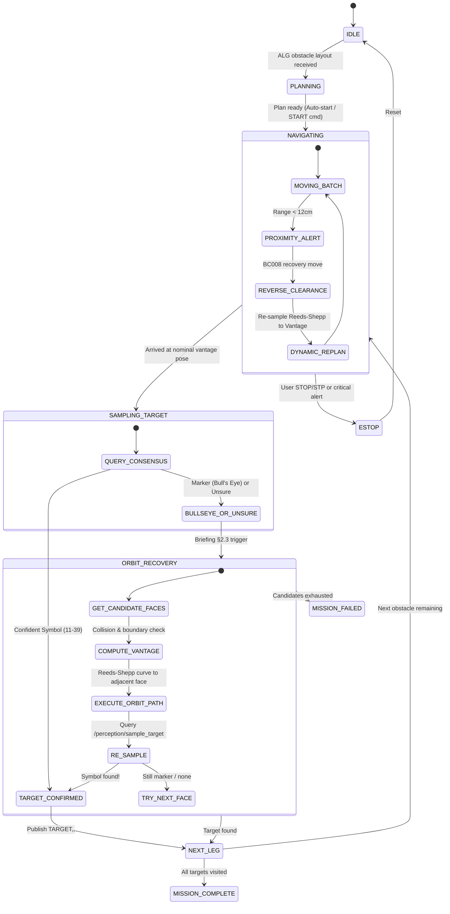

# SC2079 MDP: Task 1 Autonomous Planner & Mission FSM Architecture

This document details the Finite State Machine (FSM) architecture, Bull's Eye Orbit Recovery maneuver, communication protocol compliance (Checklist C.10), and the architectural separation between Task 1 and Task 2.

---

## 1. High-Level Architecture Overview

The autonomous mission execution stack is decoupled into clear, modular components communicating via ROS 2 topics and services:

```mermaid
graph TD
    A["Android Tablet (RFCOMM Bluetooth)"] <-->|ROBOT, TARGET, ALG| B["android_bridge_node"]
    B <-->|/android/cmd, /android/status, /android/target| C["planner_node (FSM Orchestrator)"]
    C <-->|/execute_moves (ExecuteMoves.srv)| D["serial_bridge_node (STM32)"]
    D <-->|UART3 5-byte packets| E["STM32 Motor PID & Encoders"]
    C <-->|/perception/sample_target (SampleTarget.srv)| F["perception_node (YOLO)"]
    G["Proximity Sensors (US + 2x IR)"] -->|/sensors/ultrasonic, /sensors/ir_*| C
    E -->|FIN:POS odometry stream| D
    D -->|/robot_pose| B
```

---

## 2. Finite State Machine (FSM) Lifecycle

The `planner_node` operates as an explicit Finite State Machine with defined states and deterministic transitions:



### FSM State Definitions (`MissionState`)

| State | Description | Trigger / Exit Condition |
| :--- | :--- | :--- |
| `IDLE` | Resting at start zone or waiting for layout. | Transitions to `PLANNING` on receiving obstacle layout string. |
| `PLANNING` | Parsing obstacles, solving TSP permutation, computing Reeds-Shepp trajectories. | Transitions to `NAVIGATING` once plan is generated (if `auto_start=True` or upon `START`). |
| `NAVIGATING` | Calls `/execute_moves`; the motion controller measures primitives from live feedback and emits `/cmd_vel`. | Transitions to `SAMPLING_TARGET` at the vantage pose, or `ESTOP` on proximity. |
| `AVOIDANCE_RECOVERY` | Reserved legacy state; automatic blind reverse recovery is disabled. | Proximity faults use the latched `ESTOP` path and require explicit RESET. |
| `SAMPLING_TARGET` | Stationed at vantage pose; queries `/perception/sample_target` consensus buffer (< 50 ms). | Transitions to `ORBIT_RECOVERY` if marker/bull's eye or unrecognized, or proceeds to next leg. |
| `ORBIT_RECOVERY` | Executes orbit maneuvers around the obstacle footprint to inspect neighbouring faces (Algorithms Briefing §2.3). | Transitions to the next leg when confirmed, or `MISSION_FAILED` when all candidates are exhausted. |
| `MISSION_COMPLETE` | All obstacles successfully visited, classified, and reported to Android. | Mission finishes; publishes `MISSION COMPLETE`. |
| `MISSION_FAILED` | Navigation reached an obstacle but no valid target could be confirmed after recovery. | Publishes `TARGET_UNCONFIRMED,<id>` and `MISSION FAILED`; never fabricates a symbol ID. |
| `ESTOP` | Emergency halt triggered by user command (`STP`/`STOP`) or critical failure. | Node remains halted until `RESET` is received. |

---

## 3. Bull's Eye Orbit Recovery Maneuver (Algorithms Briefing §2.3)

### The Requirement
In §2.3 of the Algorithms Briefing:
> "1) The robot may not find the image when it reaches an obstacle, instead a bull's eye is detected:
> a) Likely, the image is on a neighbouring side.
> b) Reverse and move around the obstacle.
> c) After the image is detected, continue with the next obstacle."

### Implementation (`_inspect_adjacent_faces`)

1. **Candidate Adjacent Face Generation**:
   For any nominal target face, candidate faces are ordered to test the adjacent perpendicular faces first before the opposite face:
   - Planned `N` $\rightarrow$ Candidates: `['E', 'W', 'S']`
   - Planned `S` $\rightarrow$ Candidates: `['W', 'E', 'N']`
   - Planned `E` $\rightarrow$ Candidates: `['S', 'N', 'W']`
   - Planned `W` $\rightarrow$ Candidates: `['N', 'S', 'E']`

2. **Kinematic & Safety Validation**:
   - Computes candidate vantage pose using `compute_vantage_pose(Obstacle(id, x, y, face=cand_face), d_view=25.0)`.
   - Checks arena boundary clearance: $15.0 \le x, y \le 185.0\text{ cm}$.
   - Checks body collision: `robot_collides_any(x, y, theta, arena, safety_margin=2.0) is None`.
   - Verifies Reeds-Shepp curve length is bounded ($< 160\text{ cm}$) and reachable.

3. **Autonomous Execution & Re-Sampling**:
   - Executes discretized Reeds-Shepp curve to the adjacent vantage pose via `_execute_commands_sync`.
   - Samples `/perception/sample_target`.
   - If a valid target symbol (IDs 11–39) is confirmed:
     - Saves crop to verification image.
     - Broadcasts `TARGET,<obs_id>,<symbol_id>` to the Android tablet.
     - Returns to TSP execution. Next leg dynamically re-plans from the new resting pose.
   - If candidate face also has a marker or is obstructed: tries next candidate face.
   - If all candidate faces exhausted: falls back gracefully so the 6-minute competition budget is preserved.

---

## 4. Communication Protocol Compliance

### 4.1. Checklist C.10: Robot Pose Protocol
- **Specification**: “ROBOT, \<x\>, \<y\>, \<direction\>”, where \<x\> and \<y\> are valid integer coordinates in the map and \<direction\> is one of four directions (N, S, E, W).
- **Implementation in `android_bridge_node.py`**:
  - `yaw_deg` converted to cardinal direction:
    - $[45^\circ, 135^\circ) \rightarrow \text{"N"}$
    - $[135^\circ, 225^\circ) \rightarrow \text{"W"}$
    - $[225^\circ, 315^\circ) \rightarrow \text{"S"}$
    - $[315^\circ, 360^\circ) \cup [0^\circ, 45^\circ) \rightarrow \text{"E"}$
  - Coordinates mapped to grid cells $[0..19]$: $p_x = \text{round}(x_{\text{cm}} / 10.0)$.
  - Formatted as `ROBOT,<px>,<py>,<dir>` (compatible with both the Checklist specification and the reference Android app `Arena.java`'s `indexOf("<")`).
  - Configurable parameters:
    - `use_angle_brackets_for_pose` (default: `True`)
    - `robot_coords_in_cm` (default: `False`)
    - `direction_as_cardinal` (default: `True`)

### 4.2. Android Obstacle Input Formats
`planner_node._parse_and_plan` supports all variations:
1. **Reference Android App Format (`Arena.java:2352`)**:
   `ALG:{Obstacle 1: [2,9,N,], Obstacle 2: [4,11,N,], Obstacle 3: [], ...}`
   - Automatically detects 0–19 grid coordinates and converts to centimeter centers ($x \cdot 10 + 5$).
   - Skips empty obstacles (`Obstacle 3: []`).
2. **Pipe-Delimited Format**:
   `ALG|1,60,60,N|2,130,60,E|3,130,140,W...`
3. **JSON Array / Object**:
   `{"obstacles": [[1, 15, "N"], [5, 11, "N"], ...]}`
4. **Interactive `ADD` Command**:
   `ADD,<id>,<x>,<y>,<face>`

### 4.3. Target Recognition Output
- **Topic**: `/android/target` $\rightarrow$ RFCOMM: `TARGET,<obs_id>,<symbol_id>`
- Only confirmed real target symbols (11–39) are transmitted. Bull's Eye markers (ID 40) are suppressed from direct tablet update until orbit recovery confirms the true symbol.
- If the sampler, legacy recognition fallback, and adjacent-face recovery all fail,
  the planner enters `MISSION_FAILED`. It does not publish a nominal/fabricated ID.

---

## 5. Task 1 vs Task 2 Architectural Separation

| Feature | Task 1: Navigation & Recognition | Task 2: Fastest Car Task |
| :--- | :--- | :--- |
| **Node** | `planner_node` (`mdp_bringup/planner_node.py`) | Dedicated `fastest_car_node` |
| **Launch File** | `robot.launch.py` | `task2.launch.py` |
| **Goal** | Global multi-target TSP optimization | Reactive high-speed sprint & slalom |
| **Input Data** | Pre-configured obstacle layout (`ALG:...`) | No prior coordinates; detected visually |
| **Perception** | 30+ classes (digits, letters, arrows) | Binary arrow classification (Left vs Right) |
| **Shared Services** | `/execute_moves` (STM32), `/perception/sample_target` (YOLO) | `/execute_moves` (STM32), `/perception/sample_target` (YOLO) |

Keeping the two tasks in separate nodes guarantees zero regressions for Task 1 while allowing aggressive speed optimization for Task 2.

---

## 6. Verification and Test Results

All unit tests across the entire stack pass cleanly:

```bash
# Run all test suites across algorithm, bridges, and planner FSM:
pixi run -e pi test-all
```

**Results Summary**:
- **Algorithm unit tests (`test-algo`)**: 13/13 passed (Reeds-Shepp generation, TSP solver, kinematic bounds, waypoint discretization).
- **Hardware/motion tests (`mdp_hardware_bridge`)**: 43/43 passed.
- **Android bridge tests (`mdp_android_bridge`)**: 16/16 passed.
- **Planner FSM & Recovery tests (`mdp_bringup`)**: 20/20 passed.
- **Total**: **92 / 92 tests passing (100%)**.
