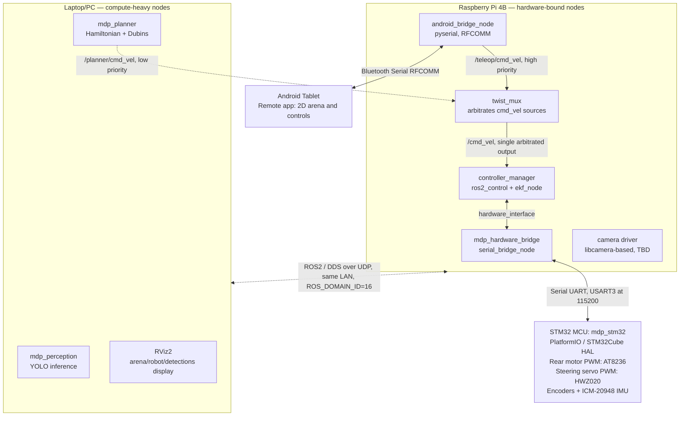

# MDP ROS2 Architecture

SC2079 Group 16 — ROS2 Jazzy implementation of the Raspberry Pi module,
living at `raspberry-pi/ros2_ws/` in this repo. It implements a
**host-side kinematics** architecture: the STM32 is a dumb hardware I/O
controller, and everything that thinks (control, sensor fusion,
perception, path planning) runs on the ROS2 host.

This is a parallel track to the non-ROS bespoke-socket implementation in
[`raspberry-pi/cv/`](../cv/) (raw Bluetooth/UART/TCP, no ROS, alongside
the existing [`docs/protocol.md`](../../docs/protocol.md)). The trained
CV weights (`Frieddeli/mdp-symbols` on HF) and all the course-material
research already captured in this repo still apply here — this doc is
about how the same problem is wired up as a ROS2 graph instead.

## System diagram

Resolved 2026-08-24: the ROS2 graph is **split across two hosts**, not run
on one machine. Hardware-bound nodes (anything touching UART, Bluetooth,
or the camera) stay on the RPi4B; compute-heavy nodes (perception,
planning, visualization) run on a laptop/PC. Both join the same ROS2
graph over plain DDS — see "Networking across hosts" below for exactly
why that "just works" on competition day but not necessarily elsewhere.



## Design principle: host-side kinematics, split across two hosts

The STM32 does **no** path planning, no odometry integration, no control
loops beyond raw PWM output — it exposes motor/servo actuation and raw
sensor reads (encoders, IMU) over UART and nothing else. Everything that
thinks runs on the ROS2 graph instead. This mirrors the course's own
recommended split (STM32 = motor control board, RPi = "brain") but
pushes *more* onto the graph than the course's bespoke-socket reference
architecture does, since ROS2 gives us `ros2_control` +
`robot_localization` instead of hand-rolled odometry.

Within that ROS2 graph, nodes are further split by **where they need to
physically be**, not by how "smart" they are:

- **Stays on the Pi** (hardware-bound — the link can't move to another
  machine): `mdp_hardware_bridge` (owns the UART link to STM32),
  `controller_manager`/`ros2_control` (owns the hardware interface that
  talks to `mdp_hardware_bridge` — keeping the control loop off Wi-Fi
  avoids jitter risk to PWM commands), `ekf_node` (cheap, keeps odometry
  latency-tight with the control loop it feeds), `android_bridge_node`
  (Bluetooth radio is on the Pi), `twist_mux` (arbitrates teleop vs.
  planner `cmd_vel` — see "Command arbitration" below; runs on the Pi
  since it feeds `controller_manager`, which is also Pi-local), the
  camera driver (physical camera is on the Pi — only *capture* stays
  here, not inference).
- **Moves to a laptop/PC** (compute-heavy, latency-tolerant): perception
  (YOLO), the Hamiltonian+Dubins planner, RViz2. No Gazebo — dropped
  2026-08-24, not enough time in the schedule for a full 3D sim track;
  RViz2's 2D display covers the course's "simulate in software"
  requirement on its own (see "Course requirements this maps to").

## Command arbitration

Two things can legitimately want to drive the robot: manual teleop
(Android tablet, via the Pi) and the autonomous planner (PC). They must
**never** both publish directly to `/cmd_vel` — two uncoordinated
writers to the same topic is a race (whichever message arrives last
wins, with no defined ordering), which could mean the robot flapping
between manual and autonomous commands unpredictably.

Fix: neither publishes to `/cmd_vel` directly. `android_bridge_node`
publishes parsed movement commands to `/teleop/cmd_vel`; `mdp_planner`
publishes to `/planner/cmd_vel`. `ros-jazzy-twist-mux` (stock package,
confirmed available on `robostack-jazzy` for all three of this
workspace's platforms) subscribes to both and arbitrates them by
priority + timeout into the single `/cmd_vel` that `controller_manager`
actually consumes — so there is always exactly one writer to `/cmd_vel`.

**Teleop is configured at higher priority than the planner** — this
isn't arbitrary, it's the standard safety convention (a human should
always be able to override autonomy, never the reverse). Two useful
side effects fall out of this for free:

- If the PC/planner is unreachable (crashed, network dropped), nothing
  arrives on `/planner/cmd_vel` — teleop keeps working through the mux,
  unaffected. This is the actual resilience property from the earlier
  discussion, achieved without ever having two things write the same
  topic.
- If someone grabs manual control mid-autonomous-run (e.g. the planner
  is doing something wrong), it takes over immediately by design.

Real cost, not hand-waved away: this is one more node to configure and
reason about (`twist_mux`'s priority/timeout YAML). It's a small,
well-tested stock package rather than custom arbitration logic, but it
is not zero-cost — worth it specifically because the alternative (raw
dual-writer `/cmd_vel`) is a genuine hazard, not because more nodes are
inherently good.

## Networking across hosts

Both machines join the same ROS2 graph via plain DDS discovery — no
Discovery Server, no `rmw_zenoh`, nothing exotic — because of two
decisions specific to this project:

1. **Same `ROS_DOMAIN_ID` on every machine** (`16`, set in this
   workspace's `pixi.toml` under `[activation.env]`, so it's applied
   automatically by `pixi run`/`pixi shell` rather than relying on
   someone remembering to `export` it). Not chosen to dodge other MDP
   groups — see point 2 — just hygiene against any other stray ROS2
   process defaulting to domain `0`.
2. **Same physical LAN on demo day.** The team brings its own
   router/hotspot, so the Pi and PC share one isolated broadcast domain
   with nobody else on it. This matters because ROS2's default discovery
   (Fast DDS's Simple Discovery Protocol) uses **UDP multicast**, which
   only works within a single L2 network — it does *not* traverse
   Tailscale (Tailscale doesn't carry multicast) or any other VPN/NAT
   hop. If development ever needs to happen with the Pi and PC on
   different networks (e.g. remote debugging before physically meeting
   up), plain `ROS_DOMAIN_ID` matching will silently fail to discover
   peers — the fix in that case is `rmw_zenoh` (no multicast
   requirement, NAT/VPN-friendly) or a Fast DDS Discovery Server, neither
   of which is set up yet since it isn't needed for the demo-day
   scenario.

## Nodes

| Node | Host | Package (planned) | Responsibility |
| --- | --- | --- | --- |
| `mdp_hardware_bridge` / `serial_bridge_node` | Pi | `mdp_hardware_bridge` | UART link to STM32 (USART3 @ 115200). Translates `ros2_control` hardware interface calls into PWM commands, and STM32 encoder/IMU frames into ROS messages. |
| `android_bridge_node` | Pi | `mdp_android_bridge` | Bluetooth RFCOMM link to the Android tablet (`/dev/rfcommN`, via `pyserial`). Relays remote-control commands in and status/telemetry out — same role as `raspberry-pi/android_bridge` in the non-ROS implementation, reimplemented as a ROS node. Parsed movement commands go to `/teleop/cmd_vel`, not directly to `/cmd_vel` (see "Command arbitration"). |
| `twist_mux` | Pi | `ros-jazzy-twist-mux` (stock) | Arbitrates `/teleop/cmd_vel` (high priority) vs. `/planner/cmd_vel` (low priority) into the single `/cmd_vel` that `controller_manager` consumes. See "Command arbitration". |
| camera driver | Pi | TBD | Publishes raw camera frames for `mdp_perception` to consume over the network. libcamera-based (see Open Decisions — **not** the legacy `picamera` module). |
| `ekf_node` | Pi | `robot_localization` (stock) | Fuses encoder odometry + IMU into a filtered pose estimate. |
| `controller_manager` + controllers | Pi | `ros2_control` / `ros2_controllers` (stock) | Owns the hardware interface abstraction and the drive controller (e.g. `diff_drive_controller` or a custom car-kinematics controller, since this is a car with steering, not a differential-drive base). |
| perception node(s) | PC | `mdp_perception` | Runs the trained YOLO model on camera frames streamed from the Pi, publishes detections. See "Can we use the reference-code checkpoint?" below for the model itself. |
| autonomy / path planner | PC | `mdp_bringup` or a new `mdp_planner` package | Implements the course-required Hamiltonian-path ordering (nearest-neighbour + 2-opt / exhaustive search over the 5 obstacles) and Dubins path segments between configurations. **This is graded coursework — must be self-implemented, not a stock Nav2 planner.** See `mdp_bringup`'s eventual `planner/` module. |
| RViz2 | PC | `ros-jazzy-rviz2` (stock) | Satisfies the course's "simulate the physical robot and algorithms in software" display requirement (arena, obstacles, robot pose, recognized images in real time). No Gazebo in this project — RViz2's 2D display covers the literal requirement without a full 3D physics sim. |

`mdp_bringup` (already scaffolded under `src/`) is the launch/config entry
point that will eventually bring all of the above up together.

## Topics, services, and messages

Concrete interface contracts between nodes. Anything not marked "(stock)"
needs a custom message and belongs in a new `mdp_interfaces` package
(see below) — `vision_msgs`/`geometry_msgs` don't have a clean slot for
this task's specific fields (numeric class IDs 11–40, `marker`,
`UNCERTAIN`, obstacle IDs).

| Topic / service | Type | Publisher → Subscriber(s) | Notes |
|---|---|---|---|
| `/teleop/cmd_vel` | `geometry_msgs/TwistStamped` (stock) | `android_bridge_node` → `twist_mux` | Parsed manual movement commands, high priority in the mux. |
| `/planner/cmd_vel` | `geometry_msgs/TwistStamped` (stock) | planner → `twist_mux` | Autonomous drive commands, low priority in the mux. |
| `/cmd_vel` | `geometry_msgs/TwistStamped` (stock) | `twist_mux` → `controller_manager` | The single arbitrated output — the only thing `controller_manager` ever listens to. Never written to directly by anything else. |
| `/odom` | `nav_msgs/Odometry` (stock) | drive controller → `ekf_node`, planner | Raw wheel-encoder odometry, pre-fusion. |
| `/imu/data_raw` | `sensor_msgs/Imu` (stock) | `mdp_hardware_bridge` → `ekf_node` | ICM-20948 readings relayed from STM32. |
| `/odometry/filtered` | `nav_msgs/Odometry` (stock) | `ekf_node` → planner, `mdp_bringup` | Fused pose estimate; this is what the planner should treat as ground truth for `(x, y, θ)`. |
| `/camera/image_raw` | `sensor_msgs/Image` (stock) | camera driver node → `mdp_perception` | From the libcamera-based driver (see Open Decisions). |
| `/detections` | `mdp_interfaces/ObstacleDetection` (custom) | `mdp_perception` → planner, `mdp_bringup` | One message per recognized obstacle: `obstacle_id`, `label` (`"11"`–`"40"` or `"marker"` or `"UNCERTAIN"`), `confidence`, `image` (`sensor_msgs/Image`, for the verification stitch). Mirrors the `image_result` JSON already drafted in the non-ROS implementation's `docs/protocol.md`. |
| `/android/cmd` | `std_msgs/String` (stock, or a thin custom msg) | `android_bridge_node` → planner | **Non-movement** commands only — obstacle placement/removal, target-face annotation (the ARCM checklist's `ADD`/`SUB`/`FACE` messages). Movement commands (`FW`/`BW`/`TL`/`TR`/`STP`) are parsed separately and go to `/teleop/cmd_vel` instead — see "Command arbitration". This split is why `android_bridge_node` needs the PC (for config) but must *not* need it for basic driving. |
| `/android/status` | `std_msgs/String` (stock) | planner/bridge → `android_bridge_node` | Curated status text relayed to the tablet — same intent as the non-ROS protocol's `STATUS,<text>` line. |
| `~/plan_run` (service or action) | `mdp_interfaces/PlanRun` (custom) | UI/bringup → planner | Kicks off the Hamiltonian-path + Dubins planning run given the known obstacle list; an action (not a plain service) if you want progress feedback as each obstacle is visited. |

## TF tree

```
map
 └── odom
      └── base_link
           ├── camera_link   (front-center, per URDF below)
           ├── imu_link
           └── (wheel/steering joint frames, from ros2_control's URDF)
```

- `odom → base_link`: published by the drive controller / `ekf_node`
  (whichever owns odometry — typically the EKF republishes a filtered
  `odom → base_link` transform).
- `map → odom`: only needed if you localize against a fixed map of the
  200×200cm arena; for Task 1/2 the arena is fully known ahead of time,
  so this may just be a static identity transform rather than a real
  localization problem — worth confirming with the team before adding
  AMCL or similar.

## Robot description (URDF/xacro) — grounded in the course spec

Not yet created (`ros-jazzy-xacro`/`robot_state_publisher` are installed
but there's no `.urdf.xacro` in the workspace yet). Numbers to encode,
taken directly from the Algorithms briefing:

| Quantity | Value | Source |
|---|---|---|
| Actual robot footprint | 20cm × 21cm | Algorithms briefing, "Robot's Environment" |
| Recommended *planning* footprint (padding) | 30cm × 30cm | Algorithms briefing, representation option 1/2 |
| Camera mount position | front-center | Algorithms briefing |
| Camera-to-obstacle ideal recognition distance | 20cm | Algorithms briefing |
| Turning radius | ~25cm (larger at speed) | Algorithms briefing |
| Arena size | 200cm × 200cm, virtual boundary | Algorithms briefing |
| Obstacle footprint | 10cm × 10cm | Algorithms briefing |
| Start zone | 40cm × 40cm, bottom-left corner at origin | Algorithms briefing |
| Robot pose convention | `(x, y, θ)`, `θ ∈ (-π, π]`, East = 0 | Algorithms briefing |

Note the unit mismatch to design around: the course spec and existing
non-ROS protocol work entirely in **centimeters**; ROS conventions
(URDF, `nav_msgs/Odometry`, TF) are entirely in **meters**. Pick the
conversion boundary deliberately (e.g. convert cm→m immediately at the
planner's input, keep everything downstream in meters) rather than
letting it leak across multiple nodes.

## STM32 serial protocol — open design tension

The non-ROS implementation's `docs/protocol.md` already defines a **discrete**
command set for RPi↔STM32: `FW:<mm>`, `BW:<mm>`, `TL:<deg>`, `TR:<deg>`,
`STP`, with the STM32 replying `ACK` then `DONE` once a move completes.
That protocol assumes the RPi issues one bounded move at a time and
waits.

`ros2_control` doesn't work that way — a `SystemInterface` writes
**continuous** command values (e.g. wheel velocity, steering angle) into
the hardware every control-loop tick (typically 50-100Hz) and reads
state back every tick; there's no notion of "move 50mm then tell me
you're done."

This is a real decision, not just a wiring detail:

1. **Change the STM32 firmware's contract** to accept a continuous
   `(velocity, steering_angle)` setpoint stream instead of discrete
   move commands, with a watchdog (stop if no new setpoint within
   ~200ms) — this is the "correct" `ros2_control` way, but means the
   STM32 firmware needs new commands beyond what `docs/protocol.md`
   currently specifies.
2. **Keep the discrete protocol and adapt at the bridge** — have
   `mdp_hardware_bridge` translate continuous `cmd_vel` into a stream of
   small discrete `FW:`/`TL:` commands. Simpler (no STM32 firmware
   change), but laggy and fights against what `ros2_control` is designed
   for.

Leaning toward (1), but this needs to be decided with whoever owns the
STM32 firmware before `mdp_hardware_bridge` is written, since it changes
what the firmware needs to expose.

## Perception message contract

- Labels: `marker` (bull's-eye, non-target) or numeric IDs `11`–`40`
  (digits 1–9 = 11–19; letters A,B,C,D,E,F,G,H,S,T,U,V,W,X,Y,Z = 20–35;
  arrows + stop = 36–40) — same 31-class set as the Roboflow dataset and
  the reference code's `data.yaml`, confirmed earlier.
- Below-threshold detections publish `label = "UNCERTAIN"` rather than a
  guessed class — mirrors the `CONF_THRESHOLD` gating already designed
  in the non-ROS implementation's `pi_infer.py`. `UNCERTAIN` is what should trigger
  the planner's reverse-and-recheck fallback (Algorithms briefing §2.3).
- The raw frame travels alongside the detection (`image` field) so
  something downstream can build the verification stitch the checklist
  requires ("stitched RAW images... shown as a single image") — don't
  reimplement stitching in two places; decide once whether that lives in
  `mdp_perception` or the planner/bringup package.

## Custom interfaces package (not yet created)

`mdp_interfaces` — holds `ObstacleDetection.msg`, and `PlanRun.action` (or
`.srv`) referenced in the topics table above. Needs to exist before
`mdp_perception` or the planner package can be written against it, so
it's a good first "real" package to scaffold after `mdp_bringup`.

## Launch files (planned, not yet written)

- `bringup.launch.py` — hardware bridge, `controller_manager`,
  `ekf_node`, perception, planner, RViz2. The one launch file used for
  real hardware runs; no separate sim variant since there's no Gazebo in
  this project (see "Course requirements this maps to" for how the
  course's simulation requirement is still satisfied).
- `teleop.launch.py` — just the Android bridge + hardware bridge, for
  early integration testing before the planner exists (equivalent to the
  non-ROS implementation's Week 2 "prove every comms link works" milestone).

## Hardware topology

- **STM32 (`mdp_stm32` firmware, PlatformIO/STM32Cube HAL):** rear motor
  PWM via AT8236 driver, steering servo PWM via HWZ020, wheel encoders,
  ICM-20948 IMU. Talks UART only (USART3 @ 115200) — no logic beyond
  reading sensors and writing PWM on command.
- **Host:** runs the full ROS2 graph. Physical placement (on the RPi4B
  itself vs. an external host PC) is not yet decided — see below.
- **Android tablet:** remote controller app, 2D arena display, connects
  over classic Bluetooth SPP/RFCOMM (matches the course's AMDTOOL-tested
  protocol, not BLE).

## Software stack (pixi-ros, ROS2 Jazzy)

Managed via `pixi.toml` in this workspace (robostack-jazzy + conda-forge
channels), resolved and locked for three platforms: `osx-arm64` (local
dev on this Mac), `linux-aarch64` (the RPi4B's real architecture — see
"Where does the ROS2 host actually run?" above), and `linux-64` (a Linux
laptop/host PC with an NVIDIA GPU, in case perception ends up offloaded
there rather than run on the Pi — same Track A/Track B split as the
non-ROS implementation's CV pipeline). All three added and verified 2026-08-24.

Note on `linux-64` + GPU: the `ultralytics` PyPI dependency pulls in
`torch`, and PyPI's Linux `torch` wheels bundle CUDA by default (unlike
macOS, which is CPU/MPS-only) — but that's a packaging fact, not a
runtime one. Confirm CUDA is actually picked up on the target laptop
(`python -c "import torch; print(torch.cuda.is_available())"`) once
deployed there; the driver/CUDA-toolkit version on the laptop itself
still has to match what the wheel expects.

| Concern          | Package(s)                                                                                                                                                                            |
| ---------------- | ------------------------------------------------------------------------------------------------------------------------------------------------------------------------------------- |
| Core             | `ros-jazzy-ros-base`, `ros-jazzy-rclpy`, `ros-jazzy-ros2cli`                                                                                                                    |
| Control + fusion | `ros-jazzy-ros2-control`, `ros-jazzy-ros2-controllers`, `ros-jazzy-robot-localization`                                                                                          |
| Perception       | `ros-jazzy-vision-msgs`, `ros-jazzy-cv-bridge`, `ros-jazzy-image-transport`, `ros-jazzy-compressed-image-transport`, `ultralytics` (pip — not a ROS package) |
| Bridges          | `pyserial` (Bluetooth RFCOMM + UART), `ros-jazzy-tf2-ros`, `ros-jazzy-tf2-geometry-msgs`                                                                                        |
| Robot description / visualization | `ros-jazzy-xacro`, `ros-jazzy-robot-state-publisher`, `ros-jazzy-joint-state-publisher`, `ros-jazzy-rviz2`. No Gazebo (`ros-gz-*`) — dropped 2026-08-24, not enough time in the schedule for a full 3D sim track. |

## Can we use the reference-code checkpoint?

Yes — `optimal_weights.txt` in the course reference code's `img_rec/`
(confirmed earlier as a genuine Ultralytics `best.pt`, ZIP structure
verified, trained on the identical 31-class label set) is usable as the
starting model for `mdp_perception`, copied into this workspace at
`raspberry-pi/ros2_ws/models/reference_code_best.pt`. Two caveats before
treating it as more than a bootstrap:

- It was trained with **non-square `imgsz=[640,480]` and `rect=True`**
  (per the decoded `args.yaml`) — the perception node's preprocessing
  must match that, not just resize frames to square 640×640, or accuracy
  degrades.
- It's an **unbenchmarked reference-code artifact** — no known mAP/
  validation numbers. Treat it as a baseline to validate against your
  own held-out data before committing to it as the actual competition
  model, not a drop-in final answer.

(Packaging note: this is a local-only file for now, not yet uploaded to
HF like the rest of this project's models/datasets — worth doing once
`mdp_perception` actually needs to load it from more than one machine.)

## Open decisions

- **Camera driver.** Must use a libcamera-based ROS node (`camera_ros`
  or `v4l2_camera` off the libcamera V4L2 device) — the legacy
  `picamera` module the course guide assumes is Buster-only and isn't a
  ROS concept at all.
- **Drive controller.** Needs a car-like (Ackermann-ish: rear drive +
  front steering servo) `ros2_control` controller, not the stock
  `diff_drive_controller` — not yet selected/written.
- **Planner package name/location.** Hamiltonian-path + Dubins planner
  not yet scaffolded as a package.
- **STM32 command interface: discrete vs. continuous.** See "STM32
  serial protocol" above — needs a decision with the STM32 firmware
  owner before `mdp_hardware_bridge` is written.
- **`map → odom` transform.** Static identity vs. real localization —
  the arena is fully known ahead of time, so a full localization stack
  (AMCL etc.) may be unnecessary overhead; not yet decided.
- **Where does image stitching live** — `mdp_perception` or the
  planner/bringup package? Only decide once, since `pi_infer.py` in the
  non-ROS implementation and this doc both flag "don't duplicate the stitching
  logic in two places."

## Course requirements this maps to

- "Simulate the physical robot and algorithms in software" → RViz2's 2D
  display (arena, obstacles, robot pose/facing, recognized images in real
  time) — matches the literal Algorithms briefing requirement (slide 40:
  "a square shape or a marker is ok" for the robot) without needing a
  full 3D physics engine. No Gazebo in this project.
- Task 1/2 autonomy, image recognition → perception node + planner
  package.
- System functionality checklist (comms, movement, image recognition) →
  the bridge nodes + `ros2_control` loop.

See the non-ROS implementation's `docs/week2-checklist.md` and
`docs/cv-integration-checklist.md` for the equivalent checklist items —
not yet ported to a ROS2-specific checklist.
