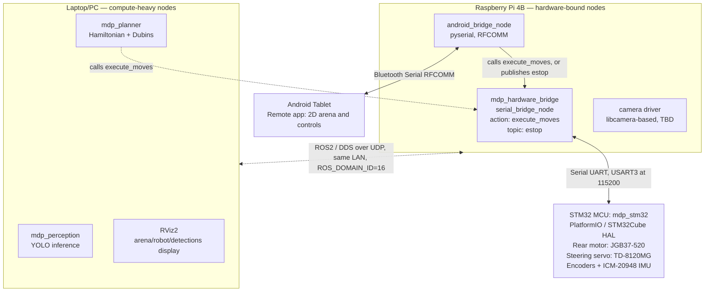

# MDP ROS2 Architecture

SC2079 Group 16 — ROS2 Jazzy implementation of the Raspberry Pi module,
living at `raspberry-pi/ros2_ws/` in this repo. It implements a
**host-side kinematics** architecture: the STM32 is a dumb hardware I/O
controller, and everything that thinks (control, sensor fusion,
perception, path planning) runs on the ROS2 host.

This is a parallel track to the non-ROS bespoke-socket implementation in
[`raspberry-pi/cv/`](../cv/) (raw Bluetooth/UART/TCP, no ROS, alongside
the existing [`docs/protocol.md`](../../docs/protocol.md)). The trained
CV weights (`Frieddeli/mdp-symbols` on HF) and all the course-material
research already captured in this repo still apply here — this doc is
about how the same problem is wired up as a ROS2 graph instead.

## System diagram

Resolved 2026-08-24: the ROS2 graph is **split across two hosts**, not run
on one machine. Hardware-bound nodes (anything touching UART, Bluetooth,
or the camera) stay on the RPi4B; compute-heavy nodes (perception,
planning, visualization) run on a laptop/PC. Both join the same ROS2
graph over plain DDS — see "Networking across hosts" below for exactly
why that "just works" on competition day but not necessarily elsewhere.



## Design principle: host-side kinematics, split across two hosts

The STM32 does **no** path planning and no ROS-level control-loop math —
but unlike the original plan here, it's *not* a dumb continuous-PWM
slave either. Confirmed 2026-08-24 by actually reading the ported
firmware (`stm32/src/main.c`'s `comm_task`): the STM32 runs its own
**closed-loop, blocking maneuvers** — "drive forward 50cm" is executed
entirely on-device with real acceleration ramping and encoder/gyro
correction, and it reports back only when the whole maneuver is done.
This directly overturned the original assumption (see "STM32 serial
protocol" below for what changed and why).

Within the ROS2 graph, nodes are split by **where they need to
physically be**, not by how "smart" they are:

- **Stays on the Pi** (hardware-bound — the link can't move to another
  machine): `mdp_hardware_bridge` (owns the UART link to STM32 and
  exposes it as an `execute_moves` action — see "Nodes" below),
  `android_bridge_node` (Bluetooth radio is on the Pi), the camera
  driver (physical camera is on the Pi — only *capture* stays here, not
  inference).
- **Moves to a laptop/PC** (compute-heavy, latency-tolerant): perception
  (YOLO), the Hamiltonian+Dubins planner, RViz2. No Gazebo — dropped
  2026-08-24, not enough time in the schedule for a full 3D sim track;
  RViz2's 2D display covers the course's "simulate in software"
  requirement on its own (see "Course requirements this maps to").

No `ros2_control`, no `controller_manager`, no `robot_localization`
EKF in this design — all three assumed a continuous velocity/steering
stream and a continuous odometry stream to fuse, and neither exists in
the real protocol. Pose tracking is dead-reckoning instead: after each
successful (`FIN`) move, whichever node commanded it updates its belief
of `(x, y, θ)` by the commanded delta, trusting the STM32's own
closed-loop accuracy for that one maneuver. The firmware has a
commented-out `SendCoordUart()` call (`stm32/src/main.c`) suggesting a
live-telemetry mode existed at some point — worth investigating if
dead-reckoning drift turns out to be a real problem, but not enabled
right now.

## Command arbitration

Simpler than the earlier `twist_mux` design, because the underlying
protocol is discrete, not continuous. Two things can legitimately want
to drive the robot: manual teleop (Android, via the Pi) and the
autonomous planner (PC). Both call the *same* `execute_moves` action on
`mdp_hardware_bridge` — there's no separate topic each writes to, so
there's no dual-writer race to design around in the first place.

Arbitration falls out of ROS2 actions' own semantics plus one rule:

- The action server's `goal_callback` **rejects a new goal while one is
  already executing** (`REJECT` if `_busy` is set — see
  `serial_bridge_node.py`). Whichever caller's goal lands first runs to
  completion; the other gets a rejected goal, not silent interleaving.
- The STM32 firmware enforces the same rule independently (`BUS`
  response if a new instruction batch arrives mid-execution) — so even
  if the ROS-side check were ever bypassed, the firmware itself won't
  execute two batches concurrently.
- **E-stop is a separate topic (`estop`, `std_msgs/Empty`), not routed
  through the action at all.** This matters: the firmware checks for a
  `Q`-prefixed packet on *every* received packet regardless of what
  `comm_task` is doing, so e-stop is genuinely asynchronous on the
  hardware side. The bridge mirrors that — `_on_estop` writes directly
  to the serial port using a separate lock that's never held during a
  long blocking read, so e-stop can preempt a batch that's actively
  executing, not just one that hasn't started yet.

This gives the same resilience property the `twist_mux` design was
built for (manual control isn't blocked by a dead/unreachable planner)
without needing a priority-arbitration node at all — there's nothing to
arbitrate between two *streams*, only between two things that might
each want to submit one *action goal* at a time.

## Networking across hosts

Both machines join the same ROS2 graph via plain DDS discovery — no
Discovery Server, no `rmw_zenoh`, nothing exotic — because of two
decisions specific to this project:

1. **Same `ROS_DOMAIN_ID` on every machine** (`16`, set in this
   workspace's `pixi.toml` under `[activation.env]`, so it's applied
   automatically by `pixi run`/`pixi shell` rather than relying on
   someone remembering to `export` it). Not chosen to dodge other MDP
   groups — see point 2 — just hygiene against any other stray ROS2
   process defaulting to domain `0`.
2. **Same physical LAN on demo day.** The team brings its own
   router/hotspot, so the Pi and PC share one isolated broadcast domain
   with nobody else on it. This matters because ROS2's default discovery
   (Fast DDS's Simple Discovery Protocol) uses **UDP multicast**, which
   only works within a single L2 network — it does *not* traverse
   Tailscale (Tailscale doesn't carry multicast) or any other VPN/NAT
   hop. If development ever needs to happen with the Pi and PC on
   different networks (e.g. remote debugging before physically meeting
   up), plain `ROS_DOMAIN_ID` matching will silently fail to discover
   peers — the fix in that case is `rmw_zenoh` (no multicast
   requirement, NAT/VPN-friendly) or a Fast DDS Discovery Server, neither
   of which is set up yet since it isn't needed for the demo-day
   scenario.

## Nodes

| Node | Host | Package | Responsibility |
| --- | --- | --- | --- |
| `serial_bridge_node` | Pi | `mdp_hardware_bridge` **(scaffolded, builds clean)** | Owns the UART link to STM32 (USART3 @ 115200). Speaks the firmware's real protocol directly — 5-byte packets (2-char command + 3-digit value), batched behind a `#` trigger, `RUN`/`FIN`/`BUS`/`FUL` status lines. Exposes this as the `execute_moves` action (`mdp_interfaces/ExecuteMoves`) plus an `estop` topic (`std_msgs/Empty`) that writes a `Q` packet outside the action entirely, mirroring the firmware's own asynchronous e-stop handling. See "Command arbitration". |
| `android_bridge_node` | Pi | `mdp_android_bridge` (not yet scaffolded) | Bluetooth RFCOMM link to the Android tablet (`/dev/rfcommN`, via `pyserial`). Movement commands get translated into `execute_moves` goals (same action the planner calls); non-movement commands (obstacle placement, target-face annotation) go to `/android/cmd` for the planner. |
| camera driver | Pi | TBD | Publishes raw camera frames for `mdp_perception` to consume over the network. libcamera-based (see Open Decisions — **not** the legacy `picamera` module). |
| perception node(s) | PC | `mdp_perception` | Runs the trained YOLO model on camera frames streamed from the Pi, publishes detections. See "Can we use the reference-code checkpoint?" below for the model itself. |
| autonomy / path planner | PC | `mdp_bringup` or a new `mdp_planner` package | Implements the course-required Hamiltonian-path ordering (nearest-neighbour + 2-opt / exhaustive search over the 5 obstacles) and Dubins path segments between configurations, translated into a sequence of `MoveCommand`s and submitted as one `execute_moves` goal per leg. **This is graded coursework — must be self-implemented, not a stock Nav2 planner.** See `mdp_bringup`'s eventual `planner/` module. |
| RViz2 | PC | `ros-jazzy-rviz2` (stock) | Satisfies the course's "simulate the physical robot and algorithms in software" display requirement (arena, obstacles, robot pose, recognized images in real time), driven by dead-reckoned pose updates (see "Design principle" above). No Gazebo in this project — RViz2's 2D display covers the literal requirement without a full 3D physics sim. |

`mdp_bringup` (already scaffolded under `src/`) is the launch/config entry
point that will eventually bring all of the above up together.

## Topics, services, and messages

Concrete interface contracts between nodes. Anything not marked "(stock)"
needs a custom message and belongs in a new `mdp_interfaces` package
(see below) — `vision_msgs`/`geometry_msgs` don't have a clean slot for
this task's specific fields (numeric class IDs 11–40, `marker`,
`UNCERTAIN`, obstacle IDs).

| Topic / service / action | Type | Publisher → Subscriber(s) | Notes |
|---|---|---|---|
| `execute_moves` (action) | `mdp_interfaces/ExecuteMoves` **(exists, builds clean)** | android_bridge_node, planner → `serial_bridge_node` | Goal: an ordered list of `MoveCommand{command, value}`. Result: `success`, `status` (`"FIN"`/`"BUS"`/`"FUL"`/...). Feedback: commands sent so far. Only one goal runs at a time — see "Command arbitration". |
| `estop` | `std_msgs/Empty` **(exists)** | android_bridge_node → `serial_bridge_node` | Writes a `Q` packet immediately, bypassing the action entirely — matches the firmware's own asynchronous e-stop handling (checked on every received packet, regardless of what's executing). |
| `/robot_pose` | `geometry_msgs/PoseStamped` (stock) | whoever tracks dead-reckoned pose (planner or `serial_bridge_node` — not yet decided) → RViz2 | Updated after each `FIN`. Not a continuous stream — one message per completed move. See "Design principle" for why there's no continuous odometry here. |
| `/camera/image_raw` | `sensor_msgs/Image` (stock) | camera driver node → `mdp_perception` | From the libcamera-based driver (see Open Decisions). |
| `/detections` | `mdp_interfaces/ObstacleDetection` (custom, not yet added) | `mdp_perception` → planner, `mdp_bringup` | One message per recognized obstacle: `obstacle_id`, `label` (`"11"`–`"40"` or `"marker"` or `"UNCERTAIN"`), `confidence`, `image` (`sensor_msgs/Image`, for the verification stitch). Mirrors the `image_result` JSON already drafted in the non-ROS implementation's `docs/protocol.md`. |
| `/android/cmd` | `std_msgs/String` (stock, or a thin custom msg) | `android_bridge_node` → planner | **Non-movement** commands only — obstacle placement/removal, target-face annotation (the ARCM checklist's `ADD`/`SUB`/`FACE` messages). Movement commands go through `execute_moves` instead. |
| `/android/status` | `std_msgs/String` (stock) | planner/bridge → `android_bridge_node` | Curated status text relayed to the tablet — same intent as the non-ROS protocol's `STATUS,<text>` line. |
| `~/plan_run` (service or action) | `mdp_interfaces/PlanRun` (custom, not yet added) | UI/bringup → planner | Kicks off the Hamiltonian-path + Dubins planning run given the known obstacle list; an action (not a plain service) if you want progress feedback as each obstacle is visited. |

## TF tree

```
map
 └── odom
      └── base_link
           ├── camera_link   (front-center, per URDF below)
           ├── imu_link
           └── (wheel/steering joint frames, from the robot's URDF —
               for RViz2 display only now, not a ros2_control interface)
```

- `odom → base_link`: published by whichever node owns dead-reckoned
  pose tracking (planner or `serial_bridge_node` — see `/robot_pose` in
  the topics table above; not yet decided which one owns this).
- `map → odom`: only needed if you localize against a fixed map of the
  200×200cm arena; for Task 1/2 the arena is fully known ahead of time,
  so this may just be a static identity transform rather than a real
  localization problem — worth confirming with the team before adding
  AMCL or similar.

## Robot description (URDF/xacro) — grounded in the course spec

Not yet created (`ros-jazzy-xacro`/`robot_state_publisher` are installed
but there's no `.urdf.xacro` in the workspace yet). Numbers to encode,
taken directly from the Algorithms briefing:

| Quantity | Value | Source |
|---|---|---|
| Actual robot footprint | 20cm × 21cm | Algorithms briefing, "Robot's Environment" |
| Recommended *planning* footprint (padding) | 30cm × 30cm | Algorithms briefing, representation option 1/2 |
| Camera mount position | front-center | Algorithms briefing |
| Camera-to-obstacle ideal recognition distance | 20cm | Algorithms briefing |
| Turning radius | ~25cm (larger at speed) | Algorithms briefing |
| Arena size | 200cm × 200cm, virtual boundary | Algorithms briefing |
| Obstacle footprint | 10cm × 10cm | Algorithms briefing |
| Start zone | 40cm × 40cm, bottom-left corner at origin | Algorithms briefing |
| Robot pose convention | `(x, y, θ)`, `θ ∈ (-π, π]`, East = 0 | Algorithms briefing |

Note the unit mismatch to design around: the course spec and existing
non-ROS protocol work entirely in **centimeters**; ROS conventions
(URDF, `nav_msgs/Odometry`, TF) are entirely in **meters**. Pick the
conversion boundary deliberately (e.g. convert cm→m immediately at the
planner's input, keep everything downstream in meters) rather than
letting it leak across multiple nodes.

## STM32 serial protocol — resolved 2026-08-24

This used to be an open question ("does `ros2_control` even fit this
firmware?") argued from the non-ROS implementation's `docs/protocol.md`
(`FW:<mm>`, `TL:<deg>`, `ACK`/`DONE`) as a proxy. It's no longer a
guess — the actual protocol was read directly out of the ported
firmware's `comm_task` (`stm32/src/main.c`), and the decision that
follows from it is made, not pending.

**The real protocol:**

- Each instruction is a fixed **5-byte packet**: a 2-char command code +
  a 3-digit zero-padded ASCII value (e.g. `b"FC050"` = drive forward
  50cm). Confirmed command codes: `FC`/`BC` (straight), `FL`/`FR`/`BL`/`BR`
  (turns), `FU`/`BU` (drive until a given ultrasound reading).
- Packets queue up (`instrList[40]`) until a **`#`-prefixed trigger
  packet** arrives, at which point the firmware replies `RUN\r\n` and
  executes every queued instruction back-to-back, **blocking** on each
  one (real acceleration/deceleration ramp, encoder + gyro correction,
  polled to completion) before moving to the next.
- Once the whole batch finishes, it replies `FIN\r\n`. Rejections:
  `FUL\r\n` (queue full) or `BUS\r\n` (already executing).
- A **`Q`-prefixed packet triggers immediate e-stop**, checked on every
  received packet independent of `comm_task`'s state — genuinely
  asynchronous on the firmware side, not queued behind anything.

**This settles the `ros2_control` question**: a `SystemInterface`
assumes continuous per-tick setpoints with live state feedback: neither
exists here, so `ros2_control`/`controller_manager` isn't the right fit
for this hardware at all — it would need to fake a continuous interface
on top of a fundamentally discrete, blocking one. Decision: don't.
`mdp_hardware_bridge` speaks the real protocol directly, exposed as the
`execute_moves` ROS2 action (`mdp_interfaces/ExecuteMoves` — a
`MoveCommand[]` goal, `success`/`status` result, "commands sent so far"
feedback) plus a separate `estop` topic that bypasses the action
entirely, mirroring the firmware's own async e-stop handling. See
`mdp_hardware_bridge/serial_bridge_node.py` (scaffolded, builds and
imports clean, packet encoding unit-checked against the confirmed
format — not yet run against real hardware).

## Perception message contract

- Labels: `marker` (bull's-eye, non-target) or numeric IDs `11`–`40`
  (digits 1–9 = 11–19; letters A,B,C,D,E,F,G,H,S,T,U,V,W,X,Y,Z = 20–35;
  arrows + stop = 36–40) — same 31-class set as the Roboflow dataset and
  the reference code's `data.yaml`, confirmed earlier.
- Below-threshold detections publish `label = "UNCERTAIN"` rather than a
  guessed class — mirrors the `CONF_THRESHOLD` gating already designed
  in the non-ROS implementation's `pi_infer.py`. `UNCERTAIN` is what should trigger
  the planner's reverse-and-recheck fallback (Algorithms briefing §2.3).
- The raw frame travels alongside the detection (`image` field) so
  something downstream can build the verification stitch the checklist
  requires ("stitched RAW images... shown as a single image") — don't
  reimplement stitching in two places; decide once whether that lives in
  `mdp_perception` or the planner/bringup package.

## Custom interfaces package (not yet created)

`mdp_interfaces` — **scaffolded 2026-08-24, builds clean.** Currently
holds `MoveCommand.msg` and `ExecuteMoves.action` (used by
`mdp_hardware_bridge`, verified importable and round-tripping the real
packet encoding). Still needs `ObstacleDetection.msg` and `PlanRun.action`
(or `.srv`) added before `mdp_perception` or the planner package can be
written against them.

## Launch files (planned, not yet written)

- `bringup.launch.py` — hardware bridge, android bridge, perception,
  planner, RViz2. The one launch file used for real hardware runs; no
  separate sim variant since there's no Gazebo in this project (see
  "Course requirements this maps to" for how the course's simulation
  requirement is still satisfied).
- `teleop.launch.py` — just the Android bridge + hardware bridge, for
  early integration testing before the planner exists (equivalent to the
  non-ROS implementation's Week 2 "prove every comms link works" milestone).

## Hardware topology

- **STM32 (`mdp_stm32` firmware, PlatformIO/STM32Cube HAL, ported from the
  course's `STM_Ref` project — see `stm32/` in this repo):** rear motor
  PWM (DC motor confirmed as **JGB37-520**, 30x gearbox, hall encoder —
  verified against `DCMotor_Encoder_ServoMotor_DataSheets_v2.pdf`; the
  H-bridge *driver chip* itself isn't independently named anywhere in the
  course materials — earlier drafts of this doc named it "AT8236," which
  doesn't appear in any course document and should be treated as
  unverified, not fact), steering servo PWM (confirmed as **TD-8120MG**,
  500-2500µs pulse width, 180° range — same datasheet; earlier drafts
  named this "HWZ020," which is also unverified and not in any course
  document), wheel encoders, ICM-20948 IMU. Talks UART only (USART3 @
  115200) — no logic beyond reading sensors and writing PWM on command.
- **Host:** runs the full ROS2 graph. Physical placement (on the RPi4B
  itself vs. an external host PC) is not yet decided — see below.
- **Android tablet:** remote controller app, 2D arena display, connects
  over classic Bluetooth SPP/RFCOMM (matches the course's AMDTOOL-tested
  protocol, not BLE).

## Software stack (pixi-ros, ROS2 Jazzy)

Managed via `pixi.toml` in this workspace (robostack-jazzy + conda-forge
channels), resolved and locked for three platforms: `osx-arm64` (local
dev on this Mac), `linux-aarch64` (the RPi4B's real architecture — see
"Where does the ROS2 host actually run?" above), and `linux-64` (a Linux
laptop/host PC with an NVIDIA GPU, in case perception ends up offloaded
there rather than run on the Pi — same Track A/Track B split as the
non-ROS implementation's CV pipeline). All three added and verified 2026-08-24.

Note on `linux-64` + GPU: the `ultralytics` PyPI dependency pulls in
`torch`, and PyPI's Linux `torch` wheels bundle CUDA by default (unlike
macOS, which is CPU/MPS-only) — but that's a packaging fact, not a
runtime one. Confirm CUDA is actually picked up on the target laptop
(`python -c "import torch; print(torch.cuda.is_available())"`) once
deployed there; the driver/CUDA-toolkit version on the laptop itself
still has to match what the wheel expects.

| Concern          | Package(s)                                                                                                                                                                            |
| ---------------- | ------------------------------------------------------------------------------------------------------------------------------------------------------------------------------------- |
| Core             | `ros-jazzy-ros-base`, `ros-jazzy-rclpy`, `ros-jazzy-ros2cli`                                                                                                                    |
| Perception       | `ros-jazzy-vision-msgs`, `ros-jazzy-cv-bridge`, `ros-jazzy-image-transport`, `ros-jazzy-compressed-image-transport`, `ultralytics` (pip — not a ROS package) |
| Bridges          | `pyserial` (Bluetooth RFCOMM + UART), `ros-jazzy-tf2-ros`, `ros-jazzy-tf2-geometry-msgs`                                                                                        |
| Robot description / visualization | `ros-jazzy-xacro`, `ros-jazzy-robot-state-publisher`, `ros-jazzy-joint-state-publisher`, `ros-jazzy-rviz2`. No Gazebo (`ros-gz-*`) — dropped 2026-08-24, not enough time in the schedule for a full 3D sim track. |

No `ros2_control`/`ros2_controllers`/`robot_localization`/`twist_mux` —
removed 2026-08-24 alongside the rest of the continuous-control design;
see "STM32 serial protocol" above for why none of them fit this
hardware's actual (discrete, blocking) protocol.

## Can we use the reference-code checkpoint?

Yes — `optimal_weights.txt` in the course reference code's `img_rec/`
(confirmed earlier as a genuine Ultralytics `best.pt`, ZIP structure
verified, trained on the identical 31-class label set) is usable as the
starting model for `mdp_perception`, copied into this workspace at
`raspberry-pi/ros2_ws/models/reference_code_best.pt`. Two caveats before
treating it as more than a bootstrap:

- It was trained with **non-square `imgsz=[640,480]` and `rect=True`**
  (per the decoded `args.yaml`) — the perception node's preprocessing
  must match that, not just resize frames to square 640×640, or accuracy
  degrades.
- It's an **unbenchmarked reference-code artifact** — no known mAP/
  validation numbers. Treat it as a baseline to validate against your
  own held-out data before committing to it as the actual competition
  model, not a drop-in final answer.

(Packaging note: this is a local-only file for now, not yet uploaded to
HF like the rest of this project's models/datasets — worth doing once
`mdp_perception` actually needs to load it from more than one machine.)

## Open decisions

- **Camera driver.** Must use a libcamera-based ROS node (`camera_ros`
  or `v4l2_camera` off the libcamera V4L2 device) — the legacy
  `picamera` module the course guide assumes is Buster-only and isn't a
  ROS concept at all.
- **Planner package name/location.** Hamiltonian-path + Dubins planner
  not yet scaffolded as a package.
- **Who owns `/robot_pose` dead-reckoning** — the planner or
  `serial_bridge_node`? Whichever tracks pose after each `FIN` and
  publishes `odom → base_link`. Not yet decided.
- **`map → odom` transform.** Static identity vs. real localization —
  the arena is fully known ahead of time, so a full localization stack
  (AMCL etc.) may be unnecessary overhead; not yet decided.
- **Where does image stitching live** — `mdp_perception` or the
  planner/bringup package? Only decide once, since `pi_infer.py` in the
  non-ROS implementation and this doc both flag "don't duplicate the stitching
  logic in two places."
- **STM32 pin mapping / part numbers vs. your actual board.** The ported
  firmware compiles and links, but its GPIO/UART/I2C/TIM assignments and
  the H-bridge driver chip's control scheme are only confirmed correct
  if `stm32/` (ported from the course's `STM_Ref` project) was built for
  the same physical kit — reasonably well-supported (same course, same
  STM32F407VET6 part, matching calibration terminology) but not proven.
  Motor (JGB37-520) and servo (TD-8120MG) are independently verified via
  datasheet; the driver chip itself is unnamed in any course document.

## Course requirements this maps to

- "Simulate the physical robot and algorithms in software" → RViz2's 2D
  display (arena, obstacles, robot pose/facing, recognized images in real
  time) — matches the literal Algorithms briefing requirement (slide 40:
  "a square shape or a marker is ok" for the robot) without needing a
  full 3D physics engine. No Gazebo in this project.
- Task 1/2 autonomy, image recognition → perception node + planner
  package.
- System functionality checklist (comms, movement, image recognition) →
  the bridge nodes (`mdp_hardware_bridge`'s `execute_moves` action,
  `android_bridge_node`).

See the non-ROS implementation's `docs/week2-checklist.md` and
`docs/cv-integration-checklist.md` for the equivalent checklist items —
not yet ported to a ROS2-specific checklist.
