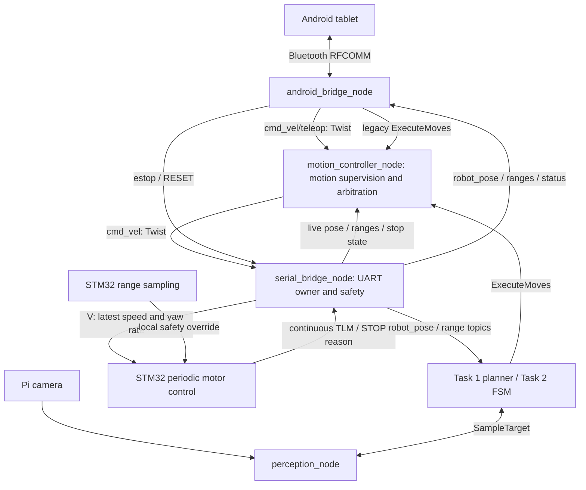

# MDP ROS 2 architecture

SC2079 Group 16 — Raspberry Pi 4B, STM32F407VET6, and Android tablet.
The Pi plans and supervises motion; the STM32 continuously controls wheel speed
and steering and can stop locally while a movement is still in progress.

The velocity refactor replaces the normal UART movement batch with replaceable
velocity setpoints. It preserves the planner's Reeds–Shepp geometry and the
`ExecuteMoves` request schema. A service call may block its caller, but it no
longer blocks sensor reception or waits for STM32 `FIN` to finish a movement.
Build and bench migration steps are in
[the migration guide](../docs/cmd-vel-migration.md); exact wire fields are in
[the UART specification](../docs/stm32-uart-protocol-spec.md).

## Control and data flow



`serial_bridge_node` is the only UART owner. It reads telemetry independently
of motion completion, uses a short transmit lock, and runs concurrent ROS
callbacks with a `MultiThreadedExecutor`. Its periodic sender sends the latest
target, rather than appending small distance commands to a firmware queue.

`motion_controller_node` owns the high-level command entry points and is the
sole `/cmd_vel` publisher in the supplied launches:

- `/cmd_vel/teleop` accepts `geometry_msgs/msg/Twist`: `linear.x` in m/s and
  `angular.z` in rad/s, positive yaw counter-clockwise. Other axes are unsupported.
  Input must be refreshed; a stale command is stopped, not replayed indefinitely.
- `/execute_moves` accepts existing `MoveCommand` lists. The Pi supervises one
  primitive at a time using fresh telemetry and publishes `/cmd_vel` velocity
  setpoints. FC/BC completion uses measured displacement, turns use accumulated
  signed heading change, and FU/BU use measured ultrasonic distance. This keeps
  existing Android, Task 1, and Task 2 callers compatible.

Android joystick/held controls send `VEL:<linear_mps>,<yaw_rps>` over Bluetooth.
`android_bridge_node` publishes these on `/cmd_vel/teleop`; release sends zero.
The controller arbitrates manual input against a movement service. The serial
bridge only consumes the resulting `/cmd_vel` and does not execute movement
primitives. A separate emergency stop can interrupt either mode. External
velocity sources must enter through the controller's input, not compete with it
on the base `/cmd_vel` topic.

While a service owns motion, teleop messages are ignored. While a live teleop
target owns motion, a service request returns `BUSY_LOCAL`. Release or input
expiry removes teleop ownership; neither source silently preempts the other.
RESET cancels the active operation and requires fresh telemetry and new input.

## STM32 responsibilities and stop behavior

The five-byte `V` packet carries signed little-endian speed (mm/s) and yaw rate
(mrad/s). Each packet replaces the previous setpoint. The motor task applies
Ackermann steering and wheel speed control periodically. Rotation in place is
unsupported: zero linear speed must imply zero yaw rate. Requested curvature is
limited to the configured minimum turning radius.

Range sampling, command reception, motor updates, and telemetry run independently
of a requested travel distance. The firmware watchdog stops velocity motion if
no fresh setpoint arrives for 300 ms. Forward proximity protection uses local raw
sensor readings, so it does not depend on ROS callbacks, filtering, or a `FIN`
response. Front sensors do not provide rear collision coverage.

`Q` is a latched emergency stop. A zero velocity command is an ordinary stop and
does not clear a latch. `R` is an explicit reset: it stops and clears old motion
state; subsequent movement requires a fresh command. `STOP:PROXIMITY`,
`STOP:WATCHDOG`, `STOP:SENSOR_STALE`, and `STOP:INVALID_VELOCITY` are asynchronous
stop reports. The Pi
aborts active motion on a stop report and requires explicit RESET. A firmware
watchdog stop alone does not latch the MCU, but the Pi still latches the fault.

Task 1 proximity interruption enters the stopped state. It does not automatically
reset the latch and reverse into unobserved space. Bull's Eye orbit recovery is
a separate perception-driven maneuver and retains normal collision validation.

The configured control rate and timeout values are design settings, not measured
braking latency. The measured full-lock radius is 21–22 cm, and the planner and
controller use 21 cm with the existing calibrated servo endpoints. The new
absolute-speed loop still requires physical speed/tracking and stopping checks.

## Packages and interfaces

| Package | Responsibility |
| --- | --- |
| `mdp_hardware_bridge` | Separate `motion_controller_node` for supervision/arbitration and `serial_bridge_node` for UART, live telemetry, and stop/reset handling. |
| `mdp_android_bridge` | Exclusive `/dev/rfcomm0` ownership, VEL-to-Twist publication, legacy movement service calls, and tablet telemetry. |
| `mdp_bringup` | Task 1/2 mission FSMs, configuration, and launch orchestration. |
| `mdp_perception` | Camera inference and target consensus via `SampleTarget`; deployment depends on the chosen launch. |
| `mdp_camera_bringup` | Pi camera capture and image publication. |
| `mdp_interfaces` | `MoveCommand`, `ExecuteMoves`, and `SampleTarget` schemas; no control logic. |
| `algorithm/` | ROS-independent arena geometry, collision checking, Reeds–Shepp paths and tour planning. |

| Interface | Type | Meaning |
| --- | --- | --- |
| `/cmd_vel/teleop` | `geometry_msgs/msg/Twist` | Manual speed and yaw rate entering the motion controller. |
| `/cmd_vel` | `geometry_msgs/msg/Twist` | Motion controller output consumed by the serial bridge. |
| `/execute_moves` | `mdp_interfaces/srv/ExecuteMoves` | Ordered primitives supervised on the Pi; result reports completion or interruption. |
| `/estop` | `std_msgs/msg/Empty` | Asynchronous latched stop. |
| `/robot_pose` | `geometry_msgs/msg/PoseStamped` | Live display/planner pose, optionally filtered, ROS metres and radians. |
| `/robot_pose/raw` | `geometry_msgs/msg/PoseStamped` | Unfiltered live feedback used by the motion controller for measured progress. |
| `/sensors/ultrasonic/raw` | `sensor_msgs/msg/Range` | Unfiltered range used for FU/BU completion. |
| `/sensors/ultrasonic`, `/sensors/ir_left`, `/sensors/ir_right` | `sensor_msgs/msg/Range` | Live range readings in metres. |
| `/perception/sample_target` | `mdp_interfaces/srv/SampleTarget` | Target symbol consensus for an obstacle. |
| `/android/cmd` | `std_msgs/msg/String` | Tablet commands including explicit RESET. |
| `/android/status` | `std_msgs/msg/String` | Human-readable status for the tablet. |
| `/hardware/maintenance` | `mdp_interfaces/srv/ExecuteMoves` | Restricted stationary GC/G0/TO service on the serial bridge; not a movement endpoint. |

The bridge converts UART pose/ranges from centimetres and heading from the
existing STM32 clockwise convention to ROS units and counter-clockwise yaw.
Do not change the established heading transform when changing velocity encoding.
The algorithm continues to use centimetres, radians, East = 0, CCW positive.
The bridge publishes `odom → base_link` when TF publication is enabled;
launch configuration supplies the arena/map relationship.

## Deployment and networking

All hardware and mission control runs on the Pi. A PC may provide perception or
visualisation when configured. Use the Pixi `pi` environment on the Raspberry Pi
and `pc` on the supported workstation; never install packages into system Python.
Both environments share the same interface source definitions.

The graph uses `ROS_DOMAIN_ID=16` and `rmw_zenoh_cpp`. Router launch configuration
must override the client `ZENOH_SESSION_CONFIG_URI`: inheriting client mode can
leave no router listening on port 7447. Node sessions use the client configs in
`config/`, and the router uses `config/zenoh_router_pi.json5`. Prefer a direct LAN
for camera traffic; a Tailscale DERP relay can make bulk video unusable even when
discovery succeeds. Foxglove connects to the configured bridge on port 8765.
Earlier network investigations are preserved in
[the architecture archive](../docs/archive/architecture-pre-cmd-vel.md).

Run offline validation/build commands from `ros2_ws/`:

```bash
pixi run -e pi test-all
pixi run -e pi build
pio run -d /home/mdp/dev/SC2079-Group-16/stm32
```

Robot launches are user manual operations only. Start one operating mode at a
time (`teleop`, `robot`, `task2`, or `hardware`) after deploying matching bridge
and firmware versions. See [the migration guide](../docs/cmd-vel-migration.md)
for staged physical checks; no hardware validation is implied by unit-test or
compile success.

This refactor does not introduce `ros2_control`, `robot_localization`, or
`twist_mux`. Continuous UART control now makes those possible future integrations,
but this implementation uses a project-specific bridge and firmware controller.
